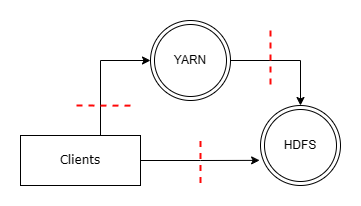
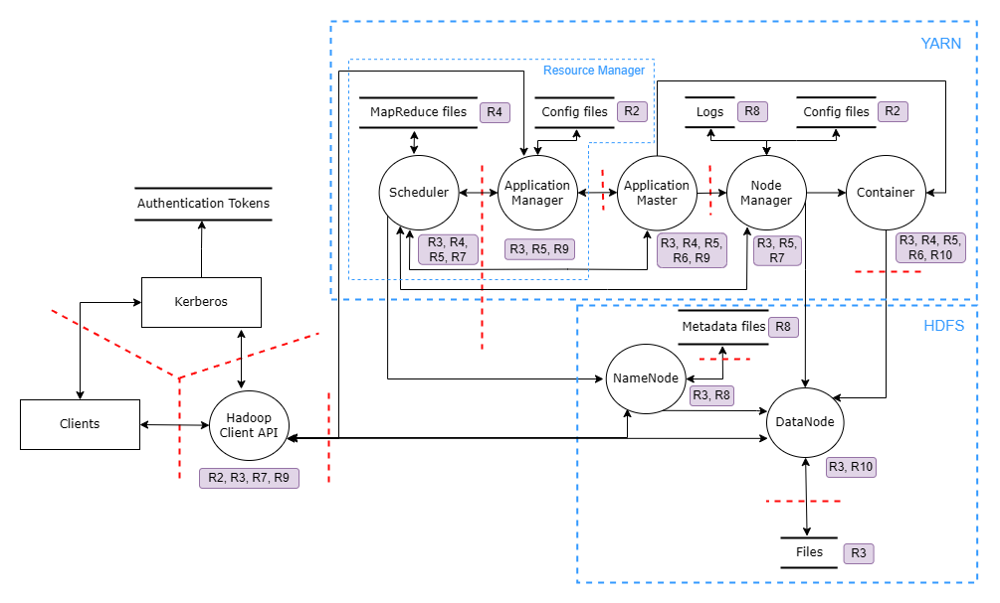
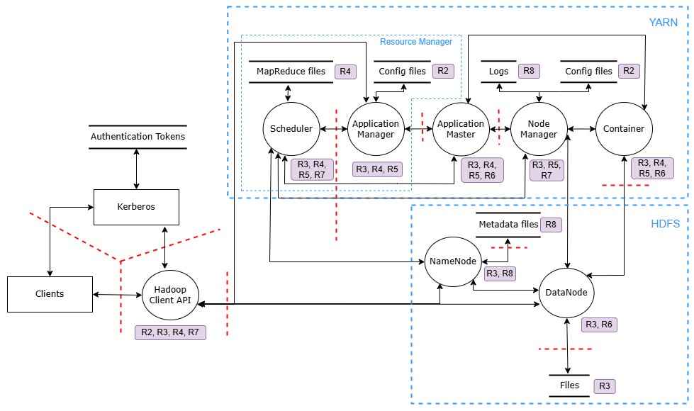

# Modelovanje pretnji nad Apache Hadoop sistemom

Tema modela pretnji je Apache Hadoop sistem.

Na dijagramu toka podataka, slika 1, predstavljena je osnovna postavka Apache Hadoop sistema. Prikazane su ključne komponente na najvišem nivou apstrakcije prilikom modelovanja.

_Slika 1. Dijagram toka podataka na najvišem nivou apstrakcije._

## Dekompozicija sistema

_Slika 2. Dijagram toka podataka dekomponovan na višem nivou detaljnosti._

Potrebno je pojasniti svaki element dijagrama i predstavljenog modela ponaosob. _Clients_ predstavljaju eksterni entitet i to bi bili korisnici ili aplikacije koje mogu komunicirati pomoću _Hadoop CLI-a, WebHDFS-a_ i slično. Neophodno je obaviti adekvatnu autentifikaciju i autorizaciju svakog korisnika, što se postiže zahvaljujući eksternom entitetu _Kerberos_. Čitav Hadoop sistem se bazira na cirkulaciji različitih tipova tokena u zavisnosti od komunikacije pojedinačnih komponenti.

Klijent može uputiti dve vrste zahteva. Prva vrsta zahteva se tiče prosleđivanja _MapReduce_ posla (engl. _Job_) koji aktivira _YARN_ komponentu koja vrši distribuiranu obradu zahteva. Druga vrsta zahteva predstavlja operaciju čitanja podataka ili operacije ažuriranja podataka (upis, brisanje i modifikacija).

Ukoliko bi klijent uputio zahtev za upis podataka, tada bi se kontaktirala _HDFS_ komponenta. Konkretnije govoreći, procesni čvor _NameNode_ enkapsulira sve zadatke i operacije koje se izvršavaju zarad obavljanja operacije čitanja podataka. _NameNode_ u svakom trenutku zna gde se koji blokovi podataka nalaze na osnovu skladišta podataka _Metadata files_. Ovime je omogućeno da adekvatno odgovori na postavljeni zahtev korisnika kroz dobavljanje podataka od odgovarajućih _DataNode-ova_. Sami _DataNode-ovi_ prvenstveno skladište blokove podataka u datotekama, što je na dijagramu specificirano kao skladište _Files_. 

Odnos između _NameNode-a_ i _DataNode-a_ je zastupljen po principu _Master-Slave_ odnosa između servera. _Slave_ ili _Worker_ server pored toga što sadrži _DataNode_ sadrži i _NodeManager_, _ApplicationMaster_ i kontejnere. Dakle, pored skladišta _Files_ na samom _Worker_ serveru se nalaze i skladišta _Logs_ i _Config files_ koja su pod direktnom ingerencijom _NodeManager_ procesnog čvora. 

Kada se šalje zahtev za obradom _MapReduce_ posla situacija je nešto drugačija. Tada je u proces obavezno uključena _YARN_ komponenta. _YARN_ komponenta poput _HDFS_ komponente prožima više elemenata. Ipak, fundamentalna komponenta predstavlja _Resource Manager_ koja se deli na _Scheduler_ i _ApplicationManager_ procesne čvorove. _Scheduler_ procesni čvor ima centralnu ulogu u _YARN_ komponenti. _Scheduler_ zajedno sa _NameNode-om_ pripada _Master_ serveru. Uloga _Scheduler_ procesnog čvora je da nadgleda i alocira sve resurse koje postoje u _Worker_ serverima. Sama _YARN_ komponenta ima svoje skladište podataka koje je privremenog karaktera, ali je izuzetno važno jer se u njemu beleže sve neophodne informacije za _MapReduce_ poslove koji su u toku ili bi trebalo uskoro da počnu. Skladište se na dijagramu može uočiti pod nazivom _MapReduce files_. Svaki posao koji pristigne od klijenta se razbija na zadatke. Posao inicijalno biva prosleđen _ApplicationManager_ procesnom čvoru koji u dogovoru sa _Scheduler_ komponentom "ispregovara" resurse. Zahvaljujući tome se kreira početni kontejner i formira _ApplicationMaster_ komponetna u jednom _Worker_ serveru. Osnovna uloga _ApplicationMaster_ procesnog čvora je upravljanje realizacijom zadataka, dok je sporedna uloga pregovaranje za dodatnim resursima sa _Scheduler_ komponentom. Konekcija ka drugim _Worker_ čvorovima se obavlja kroz _ApplicationMaster_ komponentu. Svaki _WorkerNode_ će proizvesti međurezultate koji će se kasnije u reduce fazi agregirati. Skladištenje rezultata u stalnoj memoriji prethodi vraćanju rezultata klijentu. 

## Resursi i pretnje visokog nivoa

Na slici 3 je predstavljen dijagram toka podataka Apache Hadoop sistema dekomponovan na višem nivou detaljnosti sa prikazanim kritičnim resursima. U tabeli ispod slike su navedeni svi kritični resursi.  

_Slika 3. Dijagram tokova podataka sa prikazom resursa._

**Napomena:** S obzirom da se resurs R1 propagira kroz čitav sistem, nije predstavljen na dijagramu kako ga ne bi opteretio.

| ID | Kritični resursi |
| -- | ------ |
| R1 | Tokeni (TGT, delegacioni, block access, job tokeni i slični) |
| R2 | Konfiguracioni fajlovi |
| R3 | Blokovi podataka (*) |
| R4 | Poslovi i zadaci |
| R5 | Alocirani računarski resursi: RAM, CPU i stalna memorija (*) |
| R6 | Rezultati |
| R7 | Informacije o kontejnerima |
| R8 | Logovi i informacije o sistemu |

_Tebela 1. Dijagram toko podataka sa prikazom resursa._

**Napomena:** \(*) U zavisnosti od procesnog čvora mogu predstavljati i metapodatke, ne i same podatke.

U nastavku je analiziran svaki kritični resurs kroz prizmu mogućih pretnji, zatim su određena bezbednosna svojstva resursa, koje pretnje, ukoliko su realizovane, mogu narušiti. 

| IDR | Kritični resursi | IDP | Pretnje | Tip
| -- | ------ | ----- | --- | --- | 
| R1 | Tokeni (TGT, delegacioni, block access, job tokeni i slični) | P11 | Krađa tokena ili zloupotreba tokena | S, E, I 
| R2 | Konfiguracioni fajlovi | P21 | Manipulacija konfiguracionim fajlovima može promeniti stanje sistema radi uvođenja ranjivosti | T, I, D
|  |  | P22|  Narušavanje poverljivosti konfiguracionih fajlova | I
| R3 | Blokovi podataka | P31 | Napadač želi da na maliciozni način upravlja podacima (čita, briše, upisuje) čime potencijalno narušava integritet, poverljivost i dostupnost. | D, T, I
| | | P32 | Slanje prevelikog broja zahteva radi postizanja nedostupnosti sistema. | D
| R4 | Poslovi i zadaci |P41| Slanje prevelikog broja poslova kako bi se izvršilo opterećenje *ApplicationManager* komponente.  | T, D 
| | | P42 | Podmetanje malicioznih poslova kako bi se ostvarile štetne operacije. | T, D, I, E
| R5 | Alocirani računarski resursi: RAM, CPU i stalna memorija | P51 | Podmetanje malicioznog posla koji alocira velike količine računarskih resursa.  | D, T
| R6 | Rezultati | P61 | Promena međurezultata kako bi se uticalo na tačnost konačnih rezultata | T, E, I
| R7 | Informacije o kontejnerima | P71| Lažiranje informacija o resursima kontejnera zarad ostvarivanja više resursa | T, D
| | | P72 | Podmetanje malicioznih kontejnera | S, T, D
| | | P73 | Preopterećenje ili rušenje kontejnera | D
| | | P74 | Zloupotreba kontejnera radi postizanja većih privilegija | E
| R8 | Logovi i informacije o sistemu | P81 | Lažiranje logova u cilju sabotaže sistema | T, I, R, S

_Tebela 2. Prikaz potencijalnih pretnji na resurse._

## Literatura
           
1. Terminologija korišćena u ovom dokumentu je definisana na sledećem [linku](https://github.com/Luburic/zoss-model-pretnji/blob/main/modeli/terminologija.md).
                
                    

## Vasilijev predlog

| IDR | Kritični resursi | IDP | Pretnje | Tip
| -- | ------ | ----- | --- | --- | 
| R1 | Tokeni (TGT, delegacioni, block access, job tokeni i slični) | P11 | Krađa tokena | 
| R2 | Konfiguracioni fajlovi | P21 | Zloupotreba loše konfiguracije | 
| R3 | Blokovi podataka | P31 | Neovlašćeni pristup podacima | 
| R3 |  | P32 | Neovlašćeno upravljanje podacima | 
| R4 | Poslovi i zadaci |P41| Maliciozne aktivnosti nad poslovima | 
| R5 | Alocirani računarski resursi: RAM, CPU i stalna memorija | P51 | Izazivanje nedostupnosti sistema | 
| R5 |  | P52 | Zloupotreba alociranih resursa | 
| R6 | Rezultati | P61 | Manipulacija rezultatima | 
| R7 | Informacije o kontejnerima | P71 | Zloupotreba kontejnera 
| R8 | Logovi i informacije o sistemu | P81 | Prikrivanje tragova | 
| R8 | | P82 | Izazivanje nedostupnosti generisanjem logova | 
| R8 | | P83 | Otkrivanje ranjivosti | 

**R1**
Većina *Hadoop* sistema poseduje ugrađen *Kerberos* sistem za autentifikaciju i autorizaciju, stoga su tokeni interesantani sa aspekta bezbednosti. Komunikacija između komponenti se zasniva na tokenima. 

**P11**
Uzevši u obzir upotrebu tokena, napadači mogu ukrasti tuđe tokene i na taj način obezbediti neovlašćeni pristup.

**R2**
Konfiguracioni fajlovi *Hadoop* komponenti su vrlo česta meta napadača.

**P21**
S obzirom da *Hadoop* poseduje puno komponenti, kao i konfiguracionih fajlova, napadači su svesni te činjenice i gledaju da to iskoriste na maliciozni način. Osnovna ideja jeste da se zahvaljujući podrazumevanim i loše definisanim konfiguracinom fajlovima ostvari neovlašćeni pristup podacima kako bi se posledično sabotirali vlasnici podataka. 

**R3**
Blokovi podataka su obično *honey pot* za napadače. 

**P31**
Napadači mogu na različite načine zloupotrebiti podatke za koje nemaju prava. Na primer, mogu ukrasti poverljive podatke drugih korisnika i zlouputrebiti ih radi ucene. Takođe ih mogu prodati na crnom tržištu.

**P32** 
Napadači vrlo često žele da naruše integritet i dostupnost podataka. Na primer, ukoliko bi napadač neovlašćeno čitao podatke, možda mu to ne bi bilo dovoljno za adekvatnu ucenu žrtve. Već bi šifrovanje ili kopiranje pa brisanje takvih podataka bilo efektivnije. Ukoliko bi napadač bio angažovan od strane malicioznog partnera, upravljanjem poverljivim podacima bi uspeo da izmeni ugovore od značaja.  

**R4** 
Poslovi i zadaci izazivaju alociranje resursa potrebnih za obradu podataka. Iz blokova podataka se vrši isključivo čitanje. Poslovi su interesantna meta, jer njihovo kreiranje inicira alociranje resursa. 

**P41** Napadači najčešće kradu tuđe poslove kako bi neovlašćeno čitali podatke koji su predmet obrade. Ukradene podatke mogu zloupotrebiti na različite načine protiv vlasnika. Takođe, napadači kradu tuđe poslove i kako bi alocirane resurse iskoristili za svoje maliciozne potrebe. Na primer, mogu praviti privremene bot mreže. Ne tako često se krađom poslova sabotira rad inicijatora poslova što za posledicu ima nedostupnost sistema.

**R5**
Alocirani računarski resursi: RAM, CPU i stalna memorija

Ovaj kritični resurs, kao i njegove pretnje su visoko korelisani sa R4 i P5...

**P51** Ciljano zauzimanje što veće količine resursa kako bi se izazvala nedostupnost sistema čime se utiče negativno na reputaciju poslovnog entiteta.

**P52** Upotreba alociranih resursa za ispunjenje malicioznih aktivnosti. Napadači žele da alocirane resurse koriste za svoje maliciozne radnje, umesto za osnovnu namenu.
___
**R6**
Rezultati izračunavanja su interesantni iz aspekta bezbednosti, jer se *Hadoop* sistemi koriste i za obradu podataka. Neretko, rezultat obrade podataka predstavlja znanje koje služi za donošenje poslovnih odluka.

**P61** 
Napadač može na perfidan način manipulisati rezultatima, što za posledicu ima loše upravljanje poslovnim entitetom. 
___

**R7** Informacije o kontejnerima

**P71** Zloupotreba kontejnera

___
**R8** Logovi poseduje značajne informacije o radu sistema i neretko obiluju osetljivim podacima. Ova vrsta resursa je korisna napadaču iz više razloga. Na primer:
* Podmetanje i izmena podataka.
* Krađa logova.
* Neovlašćeno čitanje logova.
* Uvid u mehanizme i arhitekturu sistema. 
* Otkrivanje propusta i osetljivih podataka.

**P81**  Napadač nakon što je izvršio maliciozne radnje može poželeti da prikrije svoje tragove. Sem prikrivanja može biti korisno i menjanje podataka kako bi se izvršilo podmetanje i kako bi se neko drugi okrivio. 

**P82** Postoje slučajevi i kada napadač poznavajući mehanizme generisanja logova može inicirati kreiranje velike količine logova. Posledica ove pretnje je nedostupnost sistema.

**P83** Ukoliko napadač planira da realizuje neke kompleksnije pretnje vrlo verovato će se zainteresovati za analizu logova. Logovi će mu obezbediti dublje razumevanje sistema, kao i potencijalne bezbednosne propuste. 
