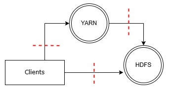
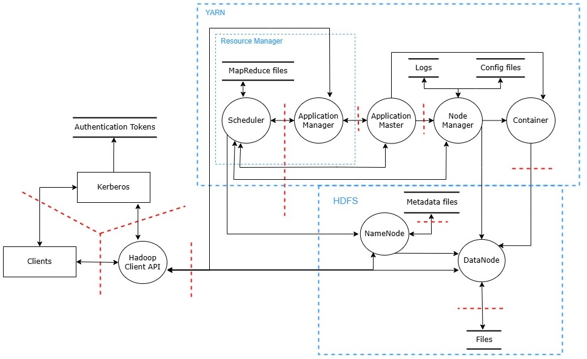
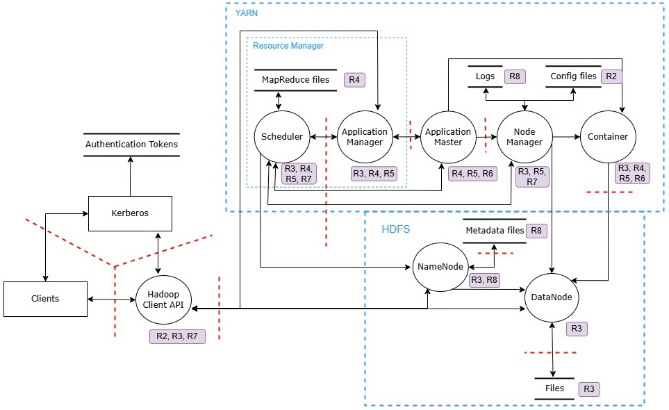

# Modelovanje pretnji nad Apache Hadoop sistemom

Na dijagramu tokova podataka koji će u nastavku biti prikazan, predstavljena je osnovna postavka Apache Hadoop sistema u kojem su prikazane ključne komponente na najvišem nivou apstrakcije prilikom modelovanja.

## Dijagram tokova podataka

_Slika 1. Dijagram na najvišem nivou._

_Slika 2. Dijagram dekomponovan maksimalno potrebno za naš model pretnji._

Potrebno je pojasniti svaki element dijagrama i predstavljenog modela ponaosob. **_Clients_** predstavljaju eksterni entitet i to bi bili korisnici ili aplikacije koje mogu komunicirati pomoću Hadoop CLI-a, WebHDFS-a i slično. Neophodno je obaviti adekvatno autentifikaciju i autorizaciju svakog korisnika, to se postiže zahvaljujući eksternom entitetu **_Kerberos_**. Ukoliko bi klijenti na primer uputili zahtev za upis podataka, tada bi se kontaktirao **_HDFS_**. Konkretnije, procesni čvor **_NameNode_** enkapsulira sve zadatke i operacije koje se izvršavaju zarad obavljanja operacije čitanja podataka. **_NameNode_** u svakom trenutku zna gde se koji blokovi podataka nalaze na osnovu skladišta podataka _**Metadata files**_. Time mu je omogućeno da adekvatno odgovori na postavljeni zahtev korisnika kroz dobavljanje podataka od odgovarajućih _**DataNode-ova**_. Sami _**DataNode-ovi**_ sem skladištenja blokova podataka u datotekama, skladište i logove kao i konfiguracione fajlove, što je na dijagramu specificirano kao skladišta _**Files, logs i config file**s_. Kada se šalje zahtev za obradom **_MapReduce_** zadataka situacija je nešto drugačija. Tada je u proces uključen **_YARN_** koji fundamentalno predstavlja _**Resource Manager**_. Sam **_YARN_** ima svoje skladište podataka koje je privremenog karaktera, ali je izuzetno važno jer se u njemu beleže sve neophodne informacije za **_MapReduce_** zadatke koji su u toku ili bi trebalo uskoro da počnu. 

## Resursi

_Slika 3. Dijagram sa prikazanim kritičnim resursima._

| | Kritični resursi |
| R1 | Tokeni (TGT, delegacioni, block access, job tokeni,...) |
| R2 | Konfiguracioni fajlovi |
| R3 | Blokovi podataka |
| R4 | Dekomponovani zadaci |
| R5 | Informacije o CPU zauzeću |
| R6 | Međurezultati |
| R7 | Informacije o kontejnerima |
| R8 | Logovi i informacije o sistemu |