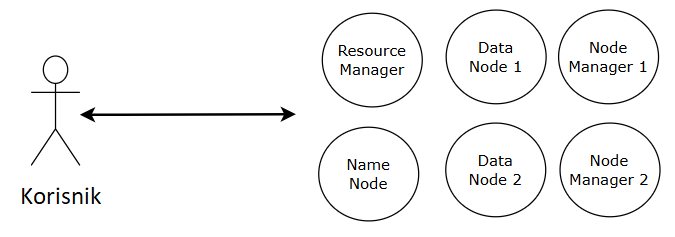
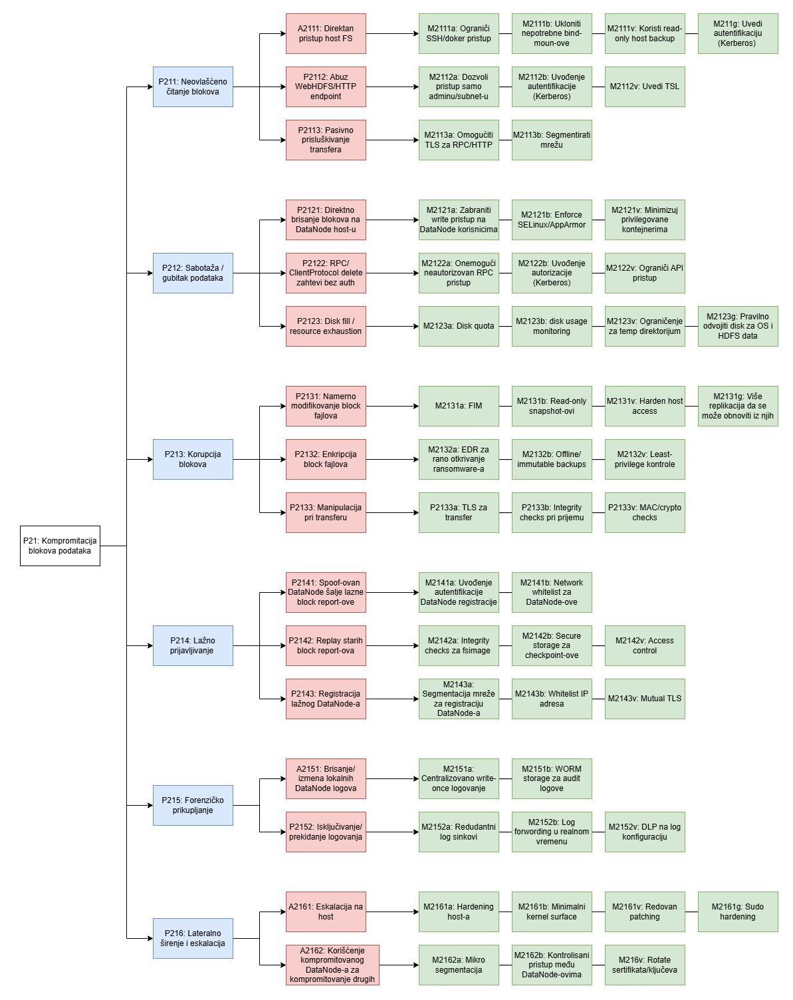
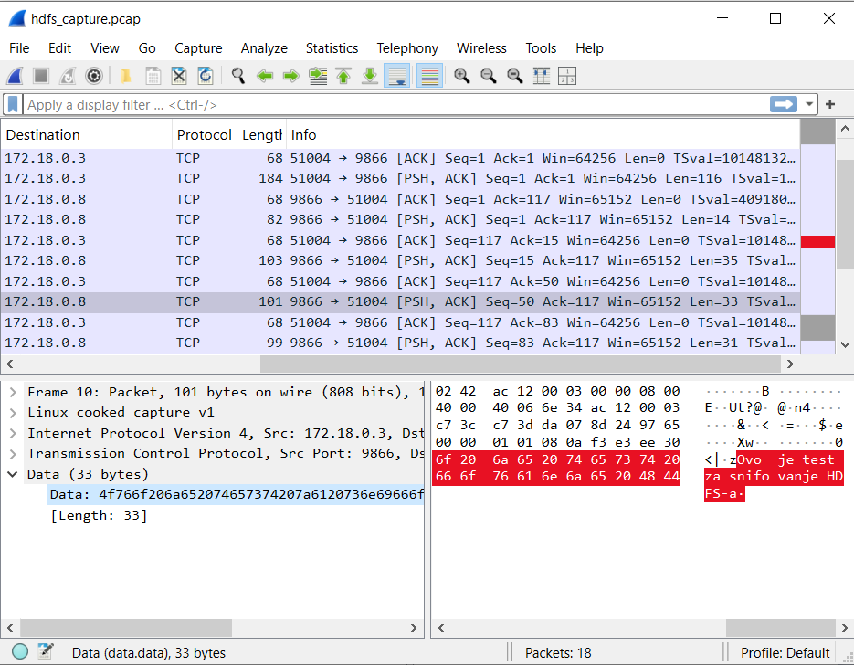

# Korišćeni _Hadoop_ klaster

Za analizu napada iskorišćen je nezaštićen _Hadoop_ klaster [[2]](#[2]). Sa bezbedonosnog aspekta, klaster ima samo osnovne elemente. U praksi se najčešće koristi operativni sistem _Linux_ za pokretanje čvorova [[3]](#[3]). Kada je klaster nezaštićen, korisnik može da komunicira sa bilo kojim čvorom, putem nezaštićenih javnih servisa ili putem terminal sesije direktno pomoću _SSH_ i _Hadoop_ klijent interfejsom. Arhitektura na visokom nivou apstrakcije je data na slici 1. Kod distribuiranih sistema su konfiguracije i korisnici redudantno prisutni na svim čvorovima [[4]](#[4]). U ovom delu najveći fokus je stavljen na _DataNode_-ove HDFS komponente.



_Slika 1: Apstrakovana arhitektura komunikacije sa Hadoop klasterom_

_Hadoop_ klaster korišćen u ovom delu nema implementirane napredne bezbedonosne mehanizme. Standardno definisane kontrole pristupa _Hadoop_ klasteru podrazumevaju da korisnik ili dobija potpun pristup klasteru ili ga nema uopšte [[5]](#[5]). Na taj način, kontrola pristupa je svedena na nivo čvora koji učestvuje u klasteru. Ovakav pristup je čest u praksi jer se klasteri podižu u "bezbednim okruženjima" [[6]](#[6]).

# Stablo napada

Stablo napada na slici 2, predstavlja analizu pretnje visokog nivoa _Neovlašćeni pristup podacima (P21)_. Pretnja je detektovana ugroženim kritičnim resursom _Blokovi podataka (R2)_. 



_Slika 2: Stablo napada razvijeno za pretnju visokog nivoa Neovlašćen pristup podacima (P21)_

U nastavku je dat kratak opis pretnji niskog nivoa, konkretnih napada i mitigacija relevantnih za njih. Takođe, u tabeli 1 je prikazana svaka pretnja niskog nivoa zajedno sa odgovarajućim _STRIDE_ tipom.

P211: Neovlašćeno čitanje blokova (eksfiltracija blokova)
- P2111: Direktan pristup host _FS_ (ili _container mount_)
    - Napadač sa _shell_ / FS pristupom kopira blokove podataka iz _/dfs/data/current_.
    - Mitigacije:
        - M2111a: Ograničiti _SSH_ / doker pristup (_least privilage_)
        - M2111b: Ukloni nepotrebne _bind-mount_-ove 
        - M2111v: Koristi _read-only mount_-ove za host _backup_
        - M2111g: Uvođenje autentifikacije (_Kerberos_)
- P2112: _Abuz WebHDFS / HTTP endpoint_ 
    - _WebHDFS_ ili _NameNode UI_ bez autorizacije dozvoljava _`user.name`_ impersonaciju i skidanje blokova.
    - Mitigacije:
        - M2112a: Onemogući ili ograniči _WebHDFS_ ili _firewall_-om dozvoli samo pristup adminu / subnet-u
        - M2112b: Uvođenje autentifikacije (_Kerberos_)
        - M2112v: Uvođenje TLS-a
- P2113: Pasivno prisluškivanje transfera (_MITM / sniffing_)
    - Presretanje _HDFS_ transfera između klijenta i _DataNode_ ako nema _TLS_
    - Mitigacije:
        - M2113a: Omogući _TLS_ za _RPC / HTTP_ (_in-transit encryption_)
        - M2113b: Segmentacija mreže (Privatne _VLAN_-ove / doker _networks_)

P212: Sabotaža / gubitak podataka (brisanje ili _truncate_)
- P2121: Direktno brisanje blokova fajlova na _DataNode_ hostu
    - Ručno brisanje ili preimenovanje fajlova na hostu.
    - Mitigacije:
        - M2121a: Zabrani korisnicima _write_ pristup _DataNode data_ folderu
        - M2121b: _Enforce SELinux / AppArmor_
        - M2121v: Minimalizuj broj onih koji imaju privilegije nad kontejnerima
- P2122: _RPC / ClientProtocol delete_ zahtevi bez autorizacije
    - Slanje _delete / rename_ zahteva _NameNode_-u bez autorizacije.
    - Mitigacije:
        - M2122a: Onemogući neautorizovan _RPC_ pristup (_firewall, ACL_)
        - M2122b: Uvedi _Kerberos_ autorizaciju
        - M2122v: Ograniči _API_ pristup
- P2123: Disk _fill / resource exhaustion_
    - Napadač popuni disk prostor na _DataNode_-u da uzrokuje pad / označavanje _node_-a kao _failed_.
    - Mitigacije:
        - M2123a: Disk _quot_-a
        - M2123b: Disk _usage monitoring_
        - M2123v: Ograničenje za _temp_ direktorijum
        - M2123g: Pravilno odvojeni diskovi za operativno sistem i _HDFS data_

P213: Korupcija blokova (_checksum mismatch / bitflip_)
- P2131: Namerno modifikovanje _block_ fajlova (_overwrite / truncate_)
    - Pomoću _write_ pristupa menjamo sadržaj _block_ fajlova (_checksum mismatch_).
    - Mitigacije:
        - M2131a: FIM
        - M2131b: _Read-only snapshot_-ovi
        - M2131v: _Harden host access_
        - M2131g: Dovoljno replikacija (3+) da se može obnoviti iz zdravih replika
- P2132: Enkapsulacija _block_ fajlova (ransomware)
    - Enkapsuliranje lokalnih _block_ fajlova čini podatke nečitljivim.
    - Mitigacije:
        - M2132a: _EDR_ za rano otkrivanje _ransomare_-a
        - M2132b: _Offline / immutable backups_
        - M2132v: _Least-privilege_ kontrole
- P2133: Manipulacija pri transferu (_bitflipping MITM_)
    - Menja se podatak tokom transfera bez da se menja lokalni fajl (teško bez _MITM_).
    - Mitigacije:
        - M2133a: _TLS_ za transfer
        - M2133b: _Integrity checks_ pri prijemu
        - M2133v: _MAC / crypto checks_

P214: Lažno prijavljivanje (_spoofing_) / lažni _block reports_
- P2141: _Spoof_-ovan _DataNode_ šalje lažne _block report_-ove.
    - _Regue node_ tvrdi da poseduje _block_-ove koje nema ili prijavljuje lažne _block_-ove.
    - Mitigacije:
        - M2141a: Dodavanje autentifikacije _DataNode_ registracije (_cert-based / Kerberos_)
        - M2141b: _Network whitelist_ za _DataNode_-ove
- P2142: _Replay_ starih _block report_-ova / _fsimage_-a
    - Vraćanje starih _report_-ova ili _fsimage_-a za izazivanje _inconsistency_.
    - Mitigacije:
        - M2142a: _Integrity checks_ za _fsimage_ (_hash / singing_)
        - M2142b: _Secure storage_ za _checkpoint_-e
        - M2142v: _Access control_
- P2143: Registracija lažnog _DataNode_-a (_unregistered / rogue node_)
    - _Rogue node_ se registruje i prihvata _block_ repliciranje.
    - Mitigacije:
        - M2143a: Segmentacija mreže za registraciju _DataNode_-a
        - M2143b: _Whitelist IP_ adresa
        - M2143v: _Mutual TLS_

P215: Forenžičko prikupljanje (_log tampering_)
- P2151: Brisanje / izmena lokalnih _DatNode_ logova
    - Napadač briše ili menja logove da prikrije svoje radnje.
    - Mitigacije:
        - P2151a: Centralizovano _write-once_ logovanje
        - P2151b: _WORM storage_ za _audit_ logove
- P2152: Isključivanje / prekidanje logovanja, uklanjanje _audit sink_-a
    - Prekid logovanja da bi napad ostao neotkriven.
    - Mitigacije:
        - M2152a: Redudantni _log sink_-ovi
        - M2152b: _Log forwarding_ u realnom vremenu
        - M2152v: _DLP_ na log konfiguraciju

P216: Lateralno širenje i eskalacija
- P2161: Eskalacija na hostu (_privilege escalation_, potpuni pristup _block_ fajlovima)
    - Iskorišćenje lokalne ranjivosti da se podignu privilegije.
    - Mitigacije:
        - M2161a: _Hardening host_-a
        - M2161b: Minimalni _kernel surface_
        - M2161v: Redovan _Patching_
        - M2161g: _Sudo hardening_
- P2162: Korišćenje kompromitovanog _DataNode_-a za kompromitovanje drugih _DataNode_-ova (Propagacija)
    - Lateralno širenje kroz mrežu / SSH / konfiguracije.
    - Mitigacije:
        - M2162a: Mikro-segmentacija
        - M2162b: Kontrolisani pristup između _DataNode_-ova
        - M2162v: _Rotate_ sertifikata / ključeva 

| IDP | Pretnja niskog nivoa | _STRIDE_ tip
| ----- | --- | --- | 
| P211 | Neovlašćeno čitanje | _Information disclosure_
| P212 | Sabotaža / gubitak podataka | _Denial of service_
| P213 | Korupcija blokova | _Tampering_
| P214 | Lažno prijavljivanje | _Spoofing_
| P215 | Forenzičko prikupljanje | _Repudiation_
| P216 | Lateralno širenje i eskalacija | _Elevation of privilege_

_Tabela 1: Pretnje niskog nivoa sa odgovarajućim STRIDE tipom_

# P2113: Pasivno prisluškivanje transfera (_MITM / sniffing_)

U ovom poglavlju će biti opisana realizacija napada na _Hadoop_ klaster [[2]](#[2]). U konkretnom napadu se ističe nedostatak šifrovanja poruka. Zlonamerni napadač može da presretne komunikaciju između korisnika i _Hadoop_ klastera, snimi sav saobraćaj u formatu _pcap_ i pomoću nekog alata analizira sadržaj komunikacije.

Konkretan napad bi sadržao korak zlonamernog pristupa _Hadoop_ klasteru. Dajemo predloge na koji način se to može izvesti:
- Zlonamerni napadač na primer instalira maliciozni softver _FKL keylogger_ [[7]](#[7]) na računar koji pokreće _Hadoop_ klaster. _FKL keylogger_ se pokreće odmah nakon podizanja operativnog sistema, zatim prikuplja unos korisnika i šalje ga trećem licu. Na taj način zlonamerni napadač može da dođe do kredencijala za prijavljivanje na ciljani računar. Sledeća pretpostavka je da je zlonamerni napadač imao direktan pristup računaru i iskoristio prikupljene informacije od _FKL keylogger_-a.
- Zlonamerni napadač može da iskoristi ranjivost nekog drugog kontejnera (npr. jednostavan web servis), pokrenutog na ciljanom računaru. Ako uspe da iskoristi ranjivost u _Docker_ / _Linux_ konfiguraciji, zlonamerni napadač može da iskoči iz ranjivog kontejnera i na taj način dobije pristup _Docker host_- u.

Odabran je scenario da je zlonamerni napadač istoristio neki maliciozni softver ili drugi način krađe kredencijala i pristupio računaru direktno.

Zlonamerni napadač u oba navedena slučaja, kada uspešno izvrši pristup _Docker host_-u (odabranom računaru), može da izvrši sledeću komandu. Na taj način zlonamerni napadač pristupa _Linux bash_-u _DataNode_-a na kojem želi da prisluškuje komunikaciju. 
``` sh
docker exec -it datanode1 /bin/bash
```
Sledeća akcija zlonamernog napadača bi bila provera informacija o _DataNode_-u. Na primer može se proveriti:
- Koji se operativni sistem koristi (ovo je korisno da bi se znalo na koji način da se instalira softver za prisluškivanje komunikacije). U našem slučaju u pitanju je _Debian GNU / Linux 9_ [[8]](#[8]).
``` sh
cat /etc/os-release
```
- Koji se portovi koriste (standardni portovi koje koriste _DataNode_-ovi su 9866 i 9867, ali to ne mora da bude slučaj uvek [[9]]([9])). U našem primeru smo dobili da se koriste sledeći portovi primenom komandi koje su navede ispod njih:
    - 0.0.0.0:9867 - _HDFS DataNode IPC/RPC_, komunikacija za interne kontrolere _DataNode_-a
    - 0.0.0.0:9866 - _HDFS Data transfer protocol_, na njemu se prenose stvarni podaci (blokovi)
    - 0.0.0.0:9864 - _HTTP_, _web_ interfejs za _DataNode_
    - 127.0.0.1:36017 - lokalni / privatni port, ne koristi se za komunikaciju van samog kontejnera
``` sh
apt-get update
apt-get install net-tools -y
netstat -tulnp | grep java
```

Nakon što je zlonamerni korisnik saznao informacije o _DataNode_-u čiju komunikaciju želi da prisluškuje, zbog zastarelosti operativnog sistema, potrebno je da uradi sledeće kako bi omogućio _update_ i instalirao _tcpdump_ za prisluškivanje:
``` sh
sed -i 's/deb.debian.org/archive.debian.org/g' /etc/apt/sources.list
sed -i 's/security.debian.org/archive.debian.org/g' /etc/apt/sources.list
echo "deb http://archive.debian.org/debian stretch main" > /etc/apt/sources.list
echo "" >> /etc/apt/sources.list
```

Sada je moguće da zlonamerni napadač izvrši _update_ i instalira _tcpdump_ koristeći sledeće metode:
``` sh
apt-get update
apt-get install tcpdump -y
tcpdump -i any port 9866 or port 9867 -w /tmp/hdfs\_capture.pcap
```

Kada se prekine snimanje saobraćaja (prečica _CTRL + C_) zlonamerni korisnik treba snimljen _pcap_ fajl da prebaci na lokalnu mašinu. Prvo, zlonamerni korisnik treba da izađe iz _Linux bash_-a (prečica _CTRL + D_ ili komanda _exit_). U _PowerShell_-ovom terminalu komanda kojom je prebačen _pcap_ fajl je:
``` sh
docker cp datanode1:/tmp/hdfs_capture.pcap C:\\Users\\Public\\pomocni
```

Sa lokacije _C:\\Users\\Public\\pomocni\\hdfs_capture.pcap_ zlonamerni korisnik može da preuzme _pcap_ zapis komunikacije sa _DataNode_-a. U našem scenariu predloženo rešenje bi bilo prebacivanje datoteke na _USB flash_ memoriju, _CD_ ili neko drugo alternativno rešenje. 

Na svom lokalnom računaru, zlonamerni korisnik može da analizira nešifrovane blokove podataka _DataNode_-a koje je snimio. 

Simulacija komunikacije koju smo koristili za realizaciju ovog napada jeste da smo pristupili _Linux bash_-u _NameNode_-a i izvršili sledeće komande:
``` sh
docker exec -it namenode /bin/bash
echo "Ovo je test za snifovanje HDFS-a" > test_snifovanje.txt
hdfs dfs -mkdir -p /user/root
hdfs dfs -put test_snifovanje.txt /user/root/testni_primer.txt
hdfs dfs -cat /user/root/testni_primer.txt
```

Na taj način smo izvršili komunikaciju _NameNode_-a sa _DataNode_-om. Snimili smo komunikaciju gorenavedenom tehnikom i mogli smo da demonstriramo analizu _hdfs_capture.pcap_. Konkretno smo koristili _Wireshark_ [[10]]([10]) i na slici 3 može da se vidi da je uspešno detektovan test iz našeg primera.




_Slika 3: Primena Wireshark alata za detekciju nešifrovane komunikacije_

## Mitigacije za napad P2113 (Pasivno prisluškivanje transfera)

U stablu napada je konkretno navedeno šta je moguće da uradimo kako bismo sprečili ovu vrstu napada, a u nastavku ćemo obrazložiti način implementacije.

- M2113a: Implementacija _TLS_ enkripcije [[11]](#11)
    - Upotreba _Transport layer security_ protokola je najdirektnija i najefikasnija tehnika za neutralizaciju _sniffing_ napada.
    - Svi podaci koji se prenose između _DatNode_-a i korisnika / drugih _DataNode_-ova treba da budu šifrovane.
    - Čak i da zlonamerni napadač uspe da snimi saobraćaj (kao u gorenavedenoj demonstraciji), podaci iz blokova će biti nečitljivi.
    - Ukratko koraci koje je potrebno preduzeti:
        - Kreiranje digitalnih sertifikata za klaster.
        - Uključivanje enkripcije na transportnom sloju u _HDFS_ konfiguraciji.
        - Distribuiranje generisanih ključeva na sve _DataNode_-ove i _NameNode_-ove.
- M2113b: Segmentacija mreže [[12]](#12)
    - Segmentacija mreže je odbrambena tehnika za ograničavanje sposobnosti napadača da se kreće kroz mrežu ili prisluškuje saobraćaj.
    - Principi segmentacije:
        - Izolacija _Data_ transfera: _HDFS data transfer_ (port 9866) i _RPC_ saobraćaj se izdvoje u zasebnu, privatnu mrežnu liniju nedostupnu javnim servisima.
        - Zabrana kretanja (_lateral movement_): klijentske aplikacije koje ne zahtevaju direktan pristup _HDFS_-u ne treba da budu u istoj mrežnoj zoni kao _DataNode_-ovi.
    - Ukratko koraci koje je potrebno preduzeti:
        - Definisati zasebnu _Docker_ mrežu za _HDFS_ komunikaciju. 
        - _DataNode_-ovi se postavljaju isključivo u okviru te mreže.
        - Primena pravila _firewall_-a na _host_ kontejneru (ili računaru).
        - Omogućiti da samo _NameNode_-ovi komuniciraju sa _DataNode_-ovima.

Najbolji način za rešavanje pretnje prisluškivanja transfera jeste da se koristi i upotreba _TLS_ protokola i segmentacija mreže.
 
## Reference

<a id="[1]"></a>
[1] [Korišćena terminologija u ovom istraživačkom radu](https://github.com/Luburic/zoss-model-pretnji/blob/main/modeli/terminologija.md) _(Autor: Nikola Luburić, Pristupano: _13. decembra 2024._)_

<a id="[2]"></a>
[2] [Korišćeni Hadoop klaster](https://github.com/tmiroslav97/asvsp-architecture) _(Autor: Miroslav Tomic, Pristupano: _10. oktobra 2025._)_

<a id="[3]"></a>
[3] [Which is the best operating system to run Hadoop?](https://www.researchgate.net/post/Which_is_the_best_operating_system_to_run_Hadoop) _(Autor: Dhananjaya Gm, Pristupano: _25. juna 2025._)_

<a id="[4]"></a>
[4] [Hadoop Security: Protecting your big data platform - Provisioning of Hadoop Users](https://www.oreilly.com/library/view/hadoop-security/9781491900970/) _(Autori: Ben Spivey, Joey Echeverria, Izdato: _01. jula 2015._)_

<a id="[5]"></a>
[5] [Hadoop Security: Protecting your big data platform - Knjiga: Why Kerberos?](https://www.oreilly.com/library/view/hadoop-security/9781491900970/) _(Autori: Ben Spivey, Joey Echeverria, Izdato: _01. jula 2015._)_

<a id="[6]"></a>
[6] [Hadoop Security: Protecting your big data platform - Hadoop Security: A Brief History](https://www.oreilly.com/library/view/hadoop-security/9781491900970/) _(Autori: Ben Spivey, Joey Echeverria, Izdato: _01. jula 2015._)_

<a id="[7]"></a>
[7] [_What Is A Keylogger? Definition And Types_](https://www.fortinet.com/uk/resources/cyberglossary/what-is-keyloggers) _(Sajt: Fortinet, Pristupano: _21. oktobra 2025._)_

<a id="[8]"></a>
[8] [_Debian Linux 9_](https://www.debian.org/releases/stretch/) _(Sajt: _Debian_, Izmenjeno: _10. septembar 2023._)_

<a id="[9]"></a>
[9] [Standarsna primena portova _Hadoop_-a](https://hadoop.apache.org/docs/r3.0.0/hadoop-project-dist/hadoop-hdfs/hdfs-default.xml) _(Sajt: Apache Hadoop, Pristupano: _21. oktobra 2025._)_

<a id="[10]"></a>
[10] [_Wireshark user's guide_](http://cet4663c.pbworks.com/w/file/fetch/62450910/4663_Wireshark_manual.pdf) _(Autori: Ulf Lamping, Richard Sharpe, Ed Warnicke, Objavljeno: _2004. godine_)_

<a id="[11]"></a>
[11] [_SSL and TLS: Theory and Practice_](https://books.google.rs/books?hl=en&lr=&id=TOnNEAAAQBAJ&oi=fnd&pg=PP1&dq=tls&ots=8axxZSma1w&sig=uSyEEaxzEbFJnpR60bpcA__rEz8&redir_esc=y#v=onepage&q=tls&f=false) _(Autor: Oppliger R., Objavljeno: _30. jun 2023._)_

<a id="[12]"></a>
[12] [_A Formal Approach to Network Segmentation_](https://www.sciencedirect.com/science/article/abs/pii/S0167404820304351) _(Autori: Neerja Mhaskar, Mohammed Alabbad, Ridha Khedri, Objavljeno: _April 2021._)_
